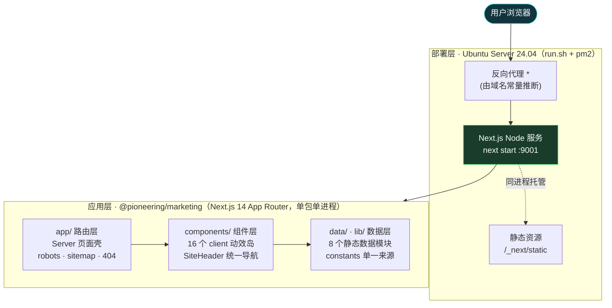
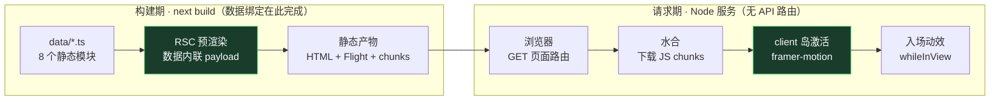
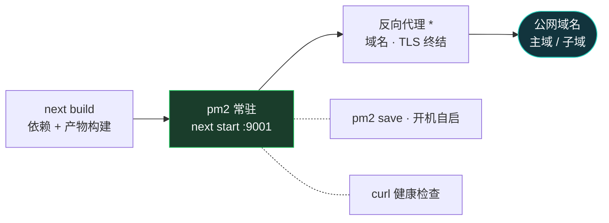

# Pioneering Marketing 站点视觉优化方案报告

> 分析对象：`apps/marketing`（Next.js 14 App Router 官网 + /trends 子站）
> 分析方式：全量源码阅读（22 个文件，约 984 行），不含运行时截图验证
> 日期：2026-09-22

---

## 一、技术栈与项目现状

### 1.1 技术栈

| 层面 | 选型 | 说明 |
|---|---|---|
| 框架 | Next.js 14.2 (App Router) + React 18 + TypeScript 5.6 | 端口 9001 |
| 样式 | Tailwind CSS 3.4 + `globals.css` @layer 组件类 | 深色主题，自定义 design token 齐全 |
| 动效 | framer-motion 11 + CSS `animate-fade-in` | 统一 ease 曲线 `[0.25,0.46,0.45,0.94]` |
| 图标/字体 | lucide-react（官网 section 使用）、next/font（Inter + Noto Sans SC） | lucide-react 未出现在 package.json 中，属隐性依赖，`npm i` 全新安装会编译失败 |
| SEO | metadata / OG / sitemap.ts / robots.ts | 基础完备 |

### 1.2 页面结构与组件组织

```
/            官网首页：OfficialHeader → Hero → Pillars → Capabilities → Ecosystem → CTA → Footer
/trends      趋势报告：Header → Hero → Trends → Data → Polar → Predictions → Footer
/not-found   404 兜底页
```

- 组件按路由分两层：`components/official/*`（官网 v2）与 `components/*`（trends 遗留 v1）。
- 页面均为 Server Component，交互/动效下沉到叶子组件（架构合理）。
- 数据与展示解耦：`data/*.ts` 集中管理文案，`lib/constants.ts` 管导航/站点元信息。
- `components/animations/fade-up.ts` 与 `stagger-container.tsx` 已抽象但**实际未被任何 section 使用**，各 section 仍各自手写重复的 motion 配置。

### 1.3 样式实现方案

- Token 层：`tailwind.config.ts` 定义了 bg / card / accent / 语义文本色 / divider 等约 20 个颜色 token，质量较好。
- 组件层：`globals.css` 提供 `.page` / `.section` / `.section-title` / `.section-subtitle` 四个全局类，`.section` 内置了 1024px / 640px 两档响应式 padding。
- 问题层：**token 定义了但未贯彻**，大量组件绕过 token 使用魔法值（见下文）。

---

## 二、视觉问题清单与优化方案

优先级定义：P0 = 明显影响观感/可用性；P1 = 影响一致性与品质感；P2 = 打磨项。
复杂度：低 = 改 className/配置即可；中 = 需小幅结构调整；高 = 需组件重构或新增模块。

### P0-1 同级卡片样式不一致（最大的一致性问题）

- **问题**：同为"卡片网格"，`PillarsSection`/`TrendCard` 用 `p-7 rounded-2xl bg-card border border-card-border`，而 `DataSection`/`PolarSection`/`EcosystemSection` 用 `p-8 rounded-2xl bg-card` **无边框**。同一页面（官网首页 Pillars vs Ecosystem 相邻）边框时有时无，内边距 28px/32px 混用。
- **建议**：在 `globals.css` 抽一个 `.card` 组件类（统一 `p-8 rounded-2xl bg-card border border-card-border`），全部卡片替换。
- **预期**：页面横向浏览时质感统一，消除"有的浮起、有的贴地"的观感。
- **复杂度：低**

### P0-2 移动端 Header 导航会溢出

- **问题**：`OfficialHeader` 在移动端仍渲染 5 个锚链链接，仅把 `gap-8` 收窄为 `gap-4`、`px-12` 收为 `px-5`，无折叠菜单。6 个文本项 + logo 在 375px 宽度下必然换行或溢出，且 `header` 高度锁定 `h-[72px]`，溢出内容会被裁切。trends 的 `Header` 同理。
- **建议**：移动端隐藏导航链接，加汉堡菜单（可先用 `<details>` 或简单 useState 折层）；或至少 `max-sm:hidden` 导航、保留 logo + CTA。
- **预期**：移动端首屏不再破版，这是营销站移动流量最敏感的位置。
- **复杂度：中**

### P0-3 大量像素魔法值破坏间距节奏

- **问题**：`padding: '100px 120px 60px'`（两个 Hero）、`padding: '60px 120px 40px'`（两个 Footer）以内联 style 硬编码，且与 `.section` 的 `80px 120px` 不在同一节奏；页面水平内边距有 120px / 40px / 20px / px-12(48px) 四套取值。120px 左右边距在小屏前没有统一断点收敛（仅 `.section` 有，Hero/Footer 没有）。
- **建议**：将页面级水平内边距收敛为一个变量（如 `.page-x { padding-inline: clamp(20px, 8vw, 120px) }`），Hero/Footer 内联 style 全部移除，改用 token 类。
- **预期**：各 section 左边缘严格对齐，页面获得统一呼吸感；窄屏下自动收敛。
- **复杂度：中**

### P1-4 色彩系统有 token 未用、有硬编码绕过

- **问题**：
  - Hero 数据条背景 `rgba(30,30,35,0.53)` 是裸硬编码，与 `bg-card`（#1E1E23）不是一个色值，出现第三种卡片色。
  - accent 定义了 `ight`（拼写应为 `light`，疑似笔误，且 0.13/0.10 两档透明度语义不清），全局混用。
  - `text-muted2`/`text-dim` 层级过近（#64748B vs #475569），正文辅助文字与"最弱文字"区分度低。
- **建议**：数据条改用 `bg-card/60` + backdrop-blur；修正/合并 accent token；将 muted2 与 dim 拉开或合并为一档。
- **预期**：色彩收敛回 3 个卡片层级 + 1 个强调色，颜色更干净。
- **复杂度：低**

### P1-5 文字排版层级过碎、小字号过多

- **问题**：正文字号分布在 36 / 40 / 60px 与 10 / 11 / 12 / 13 / 15 / xs / sm / base / xl / 2xl 之间，缺乏 type scale。`text-[10px]`（数据来源标注）与 `text-[11px]`、`text-[12px]` 大量出现，在深色背景上 #64748B 以下对比度不足 4.5:1（WCAG AA 不达标），小屏可读性差。
- **建议**：在 tailwind.config 定义 `display/h1/h2/body/caption` 字号 token（如 10/11px 统一并入 12px）；正文与辅助文字最小 12px，弱化色仅允许用于非关键标注。
- **预期**：排版形成明确层级，深色底小字可读性达到 AA。
- **复杂度：中**

### P1-6 中西文字体混用规则不统一

- **问题**：`font-inter` 全局默认，中文内容靠 fallback；组件里又手动逐个加 `font-noto`，出现"同一个 section 有的标题是 Inter 回退、有的是 Noto"的隐患。`font-noto` 只配了 400/500/700，而部分中文标题是 `font-bold`（700）没问题，但 `font-medium`（500）的中文（如 CapabilityRow 标题）与 400 之间在 Windows 下区分度弱。
- **建议**：在 body 级直接设置 `font-family: Inter, 'Noto Sans SC', ...` 组合栈（拉丁用 Inter、中文自动落到 Noto），删除所有手动 `font-noto`。
- **预期**：中西文混排自动各取所长，代码减掉约 30 处冗余类。
- **复杂度：低**

### P1-7 视觉层级：官网首页缺少 section 之间的节奏变化

- **问题**：首页从 Hero 到 CTA 共 5 个 section，全部是"居中标题 + 副标题 + 卡片网格"同一模板，等宽、等 padding、等卡片圆角，滚动 3 屏后视觉疲劳；CTA 大卡片与产品卡片同为 `bg-card`，无强调。
- **建议**：
  - 至少给一个 section 做版式变化（如 CapabilitiesSection 行表已是行式，可给它加左侧粘性标题或交替底色 `bg-card/40`）；
  - CTA 卡片改为 accent 渐变描边或 `bg-accent-soft` 底，形成收尾高潮。
- **预期**：页面滚动有节奏起伏，CTA 转化区更醒目。
- **复杂度：中**

### P1-8 响应式断点覆盖不全

- **问题**：
  - `.section` 的响应式 padding 用裸 `@media` 写在 globals.css，而组件内用 `max-lg:`/`max-sm:`（max-width 断点），两套机制并存、断点值（1024/640）恰好一致但维护时要改两处；
  - Hero 标题 `text-6xl max-lg:text-5xl max-sm:text-4xl` 与 Stats Bar `text-3xl max-sm:text-2xl` 只覆盖了两档，641–1024px 区间的中屏只有 lg 一档；
  - `min-w-[260px]`/`min-w-[280px]` 魔法值控制卡片换行，等效于手写 grid，4 列在 1024–1200px 之间会出现 3+1 的尴尬换行。
- **建议**：卡片网格统一改为 `grid grid-cols-1 md:grid-cols-2 lg:grid-cols-4`（Ecosystem 为 3 列），删掉 min-w hack；断点统一走 Tailwind 配置。
- **预期**：中间尺寸屏幕不再出现孤儿卡片，网格整齐。
- **复杂度：低**

### P2-9 动效重复实现、既有抽象未使用

- **问题**：每个 section 都复制粘贴同一段 `motion.div initial/whileInView/viewport/transition`（含相同 ease 数组），`fade-up.ts` + `StaggerContainer` 写好了却没人用；`StaggerContainer` 对 `prefers-reduced-motion` 的支持也因此在实际页面中缺失（各 section 直接写 motion 时未处理 reduced motion）。
- **建议**：把 motion props 收敛成 `fadeUp(index)` 工具函数或直接启用 StaggerContainer 包裹卡片；保留 reduced-motion 分支。
- **预期**：动效代码量减约 60%，且全局尊重系统"减少动态效果"设置（无障碍加分）。
- **复杂度：低**

### P2-10 交互反馈薄弱

- **问题**：卡片只有入场动画，无 hover 状态（无 hover:border-accent、无 translate），营销站缺少"可点/可探索"的暗示；导航链接只有 color 过渡。
- **建议**：给卡片加 `transition hover:border-accent/40 hover:-translate-y-0.5`；CTA 主按钮加轻微 shadow-glow。
- **预期**：页面"活"起来，CTA 点击率通常有可感知提升。
- **复杂度：低**

### P2-11 视觉资产单薄

- **问题**：整站除 Logo SVG 外无任何插画/图形/渐变装饰，Hero 是纯文字，深色底大面积空旷；badge、数据条视觉密度低。
- **建议**：Hero 右侧或背景加低饱和渐变光斑（radial-gradient，accent 10% 透明度）+ 网格纹理；数据条数字用 accent 渐变文字点缀。
- **预期**：首屏第一印象从"文档页"升级为"产品官网"。
- **复杂度：中**

### P2-12 双套 Header/Footer 组件重复

- **问题**：`Header`/`Footer`（trends）与 `OfficialHeader`/`OfficialFooter` 结构 80% 相同，样式参数散落两份，未来改视觉要改两处。
- **建议**：合并为单一 `<SiteHeader variant="official|trends">`。
- **预期**：视觉改动单点生效，防止两个页面漂移。
- **复杂度：中**

---

## 三、实施优先级总览

| # | 问题 | 优先级 | 复杂度 | 预期效果 |
|---|---|---|---|---|
| 1 | 卡片样式不一致（边框/内边距） | P0 | 低 | 观感统一 |
| 2 | 移动端导航溢出 | P0 | 中 | 移动端不再破版 |
| 3 | 魔法值内边距破坏间距节奏 | P0 | 中 | 全页左缘对齐、呼吸感统一 |
| 4 | 颜色 token 被绕过、拼写笔误 | P1 | 低 | 色彩收敛 |
| 5 | 字号层级过碎、小字对比度不足 | P1 | 中 | 可读性达 WCAG AA |
| 6 | 中西文字体规则不统一 | P1 | 低 | 混排品质提升 |
| 7 | section 模板同质化、CTA 无强调 | P1 | 中 | 滚动节奏与转化 |
| 8 | 断点覆盖不全、min-w 手写网格 | P1 | 低 | 中屏不出现孤儿卡片 |
| 9 | 动效重复、reduced-motion 缺失 | P2 | 低 | 代码减量 + 无障碍 |
| 10 | 卡片/按钮 hover 反馈缺失 | P2 | 低 | 交互活力 |
| 11 | Hero 视觉资产单薄 | P2 | 中 | 首屏品质感 |
| 12 | Header/Footer 双套重复 | P2 | 中 | 维护性 |

**建议实施顺序**：第一批（1、4、6、8、9，均为低复杂度，半天内可完成，收益立现）→ 第二批（3、5、2）→ 第三批（7、12、10、11）。

另有一个非视觉但必须修的工程隐患：`lucide-react` 被 official 组件引用但未写入 package.json，需补依赖，否则干净环境 `npm install` 后构建直接失败（复杂度：低）。

---

## 四、总体评价

项目工程底子好：token 化意识、数据/视图分离、Server/Client Component 边界、SEO 配置都在水准之上。当前视觉问题主要不是"设计能力"问题，而是**规范执行不彻底**——token 定义了却被魔法值绕过、动画抽象写了却没接入、两代页面组件并存导致细节漂移。上述方案中 8 项属于"低复杂度收敛"即可显著提升品质感，无需推翻重来。

---

## 五、整体架构逻辑分析（2026-09-24 追加）

> 分析方式：全量源码阅读 + 实际运行验证（dev 服务器实测）
> 说明：本节为架构全景（前端技术栈、后端服务、数据层、API、组件交互、数据流转、部署架构），与第二~四节的视觉专项互补。Mermaid 图需在支持 Mermaid 的查看器中渲染（GitHub / VS Code 插件 / Typora 等）。

### 5.0 前置说明：本次分析确认的历史问题修复状态

对比本报告 09-22 版本，以下视觉/工程问题已在当前代码中落地修复：

| 报告问题 | 当前状态 |
|---|---|
| P0-1 卡片样式不一致 | 已修：`globals.css` 出现统一 `.card` 类（`rounded-2xl bg-card border` + hover 反馈） |
| P0-2 移动端导航溢出 | 已修：`SiteHeader` 增加汉堡菜单（`< md` 折叠，`aria-expanded` 无障碍标注） |
| P0-3 魔法值内边距 | 已修：`--page-x: clamp(20px, 8vw, 120px)` 变量收敛页面水平内边距 |
| P2-9 动效抽象未接入 | 部分修复：`fadeUp()` 工厂已被 OfficialHero / PillarsSection / DataSection 等使用；`StaggerContainer` 仍为零引用死代码 |
| P2-12 Header/Footer 双套重复 | 已修：`SiteHeader` 统一实现，`Header`/`OfficialHeader` 变为注入 `left`/`nav` 的薄封装 |
| 隐性依赖 lucide-react | 已修：已写入 package.json dependencies |

### 5.1 系统分层架构与模块职责



**模块职责一览**：

| 模块 | 职责 | 关键实现 |
|---|---|---|
| `app/` | 路由与全局壳 | `layout.tsx`（字体 + MotionProvider + 全局 metadata）、`page.tsx`（官网）、`trends/page.tsx`（子站）、`not-found.tsx`、`robots.ts`/`sitemap.ts`（Metadata Routes，构建期生成） |
| `components/` | 展示与动效 | 页面壳全为 Server Component；16 个 section 标 `'use client'` 承载 framer-motion；`SiteHeader` 注入式统一导航 |
| `components/animations/` | 动效基建 | `fadeUp(delay)` props 工厂统一入场四件套；`MotionProvider` 用 `MotionConfig reducedMotion="user"` 全局无障碍降级 |
| `data/` | 内容源 | 8 个静态 TS 模块（约 12.8KB），构建期 import 内联 |
| `lib/constants.ts` | 站点常量单一来源 | `SITE`（trends）/ `OFFICIAL_SITE`（官网）双集合，保留 v2 重构演进痕迹 |

**核心技术选型依据**：

| 层 | 选型 | 依据 |
|---|---|---|
| 框架 | Next.js 14.2.35 + React 18.3（App Router） | 营销站 SEO 硬需求：metadataBase / OG / canonical / robots / sitemap 全套 Metadata API；RSC 让文本内容不进 JS bundle |
| 样式 | Tailwind 3.4 + globals.css 双 token 层 | tailwind.config.ts 语义色板 + `@layer components` 布局类（`.page/.section/.card/.hero-glow`），零运行时 CSS |
| 动效 | framer-motion 11 | `whileInView` 滚动入场 + reducedMotion 全局降级 |
| 字体 | next/font/google（Inter + Noto Sans SC） | 构建期自托管、`display: swap`、零 CLS |
| 数据 | 静态 TS 模块（数据即代码） | 内容变更频率低，免 CMS/DB 运维 |
| 进程 | pm2 | 单机常驻 + `pm2 save` 开机自启，运维成本最低 |

### 5.2 后端服务架构 / 数据库设计 / API 接口

结论先行：**本项目没有自建后端服务、没有数据库、没有业务 API**。

- **后端**：Node 进程仅承担 SSR/静态资源托管 + Metadata Routes 生成，全站 0 处 `fetch` 调用、无 API Route、无 middleware。
- **数据库**：不存在。数据层即 `data/*.ts`，随构建产物内联，"数据变更 = 重新构建"。
- **API 面**：对外仅有 4 类——页面路由 `/`、`/trends`、`sitemap.xml` / `robots.txt`（构建期生成）、404 兜底。无鉴权/限流设计需求，攻击面收敛为静态文件服务。

### 5.3 渲染管线与数据流转路径



关键细节：

1. **Server/Client 边界纪律**：两个页面壳（`app/page.tsx`、`app/trends/page.tsx`）无 hooks/事件，全为 Server Component；数据在服务端序列化进 Flight payload，客户端只 hydrate 交互岛。
2. **请求期零数据请求**：无 fetch / 无 API / 无 DB，页面无任何动态 API 调用 → 生产 `next build` 后可完整静态预渲染（dev 模式观测到的 `Cache-Control: no-store` 为 dev 特征）。
3. **SEO 数据流**：`lib/constants.ts` → layout/page `metadata` → `robots.ts` / `sitemap.ts` 构建期生成，单一来源无漂移。

### 5.4 部署架构



> `*` 反向代理不在仓库内，由 9001 端口与域名常量（`pioneering.ai` / `ai-trends.pioneering.dev`）推断；本地开发为 `npm run dev`，同一 Node 服务、同一端口。

`run.sh` 为幂等脚本：存在 pm2 进程则 `restart`，否则 `start` + `pm2 save` 持久化进程列表，最后 curl 健康检查。生产侧由反代按 Host 分流到 9001。

### 5.5 实际运行验证（2026-09-24，dev 模式）

| 验证项 | 结果 | 说明 |
|---|---|---|
| `GET /` | 200，HTML 32.6KB | 含 `__next_f` Flight payload，RSC 渲染生效 |
| `GET /trends` | 200，HTML 23.5KB | 子站正常 |
| `GET /sitemap.xml` | 200 | 3 条 URL，lastmod 为生成时间 |
| `Cache-Control` | `no-store` | dev 特征；生产构建后页面可完整静态化 |
| 安全头 | `X-Powered-By: Next.js` 泄露 | 见 5.7 优化项 P1 |
| 冷启动 | Ready in 5.7s | — |

### 5.6 架构优势

1. **零后端依赖**：无 DB、无 API、无第三方运行时调用 → 攻击面极小、无数据泄露路径、可用性只取决于 Node 进程本身。
2. **RSC 边界纪律清晰**：页面壳全 Server，动效岛 client 化，遵循"server 默认、client 例外"的正确方向。
3. **设计系统双层收敛**：语义 token（tailwind.config）+ 布局组件类（globals.css `@layer`），新 section 组合 `.card/.section` 即可保持视觉一致。
4. **SEO 完备度高**：metadataBase + title template + OG/Twitter + canonical + sitemap + robots + 404。
5. **无障碍细节**：`reducedMotion="user"` 全局降级、汉堡菜单 `aria-expanded`、CSS `prefers-reduced-motion` 双兜底。
6. **部署幂等**：run.sh 可重复执行，进程列表持久化，服务器重启自动恢复。

### 5.7 瓶颈与可优化点（按优先级）

| 优先级 | 问题 | 可实施优化 |
|---|---|---|
| **P0** | 全站 100% 可静态化却用 Node SSR 常驻——进程崩溃即全站下线 | `next.config.js` 加 `output: 'export'`，产物直接交 Nginx/CDN，去掉运行时依赖；代价是放弃未来 API Route 能力（营销站现阶段不需要） |
| **P1** | 16 个 section 全部 `'use client'`，DataSection/PillarsSection 等纯展示卡也进 JS bundle | 拆为 server 壳 + 仅 motion 子组件 client 化，或入场动效改 CSS `@keyframes` + IntersectionObserver |
| **P1** | `X-Powered-By` 暴露框架指纹 | `next.config.js` 加 `poweredByHeader: false`（一行） |
| **P2** | `stagger-container.tsx` 零引用死代码 | 直接删除 |
| **P2** | sitemap 同时收录 `pioneering.ai/trends` 与 `ai-trends.pioneering.dev/trends`，双域名重复收录风险 | 收敛到单一 canonical 域，或子域做 301 |
| **P2** | `metadataBase` 用占位域名 `pioneering.ai` | 上线前与真实域名同步，否则 OG/canonical 指向错误地址 |
| **P3** | 无监控/分析、无 CI、无 lint 配置文件 | 接入轻量分析（如 Plausible）、GitHub Actions 跑 `lint + build` |
| **P3** | run.sh 健康检查仅重试 1 次；`pm2 start npm` 多一层 npm 包装进程 | 健康检查改重试循环；直接 `pm2 start node_modules/.bin/next` |

**架构侧一句话总结**：工程纪律良好，最大杠杆不在"加东西"，而在**去掉 Node 运行时**（静态导出）与**收敛 client bundle**——可用性与首屏性能双双受益。
