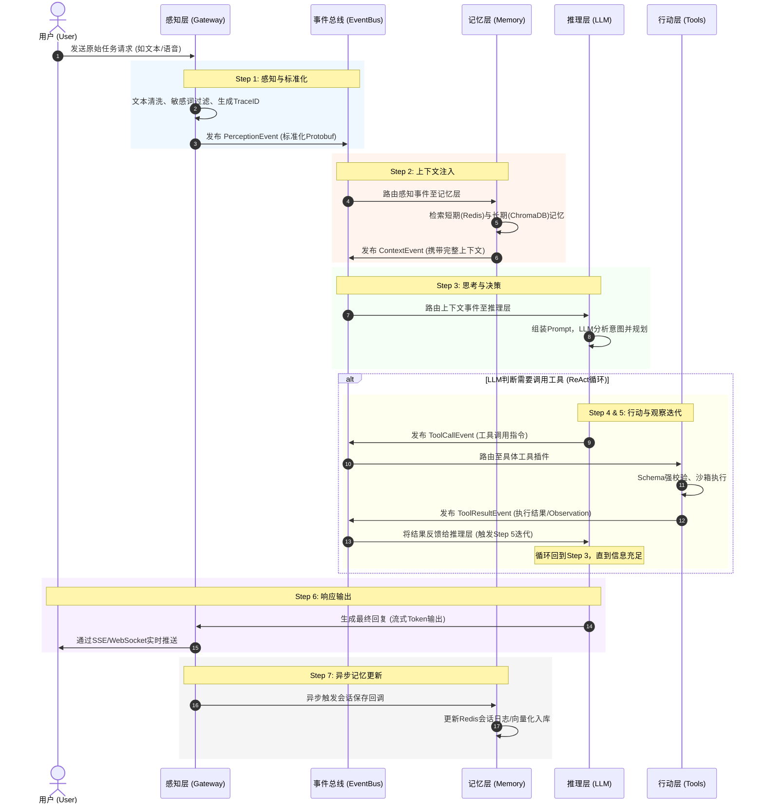
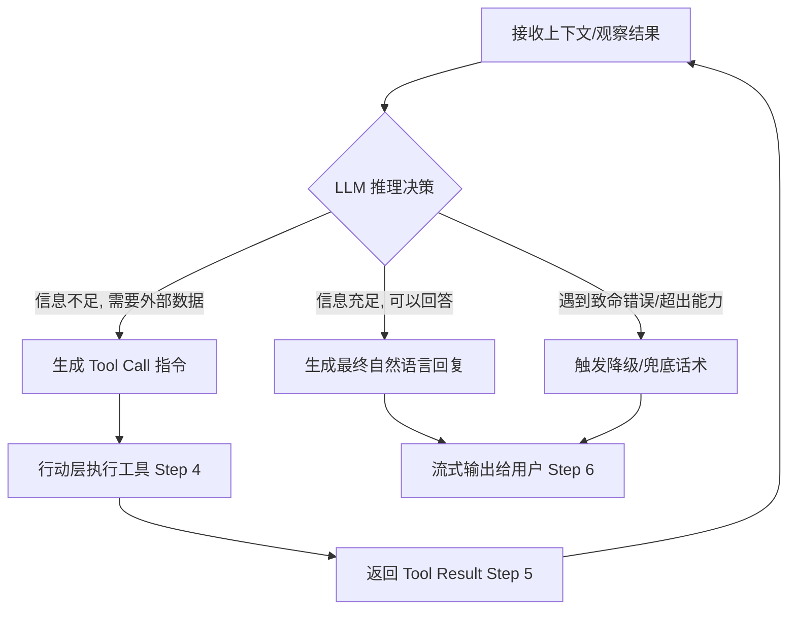

为了让您更直观、清晰地理解Agent从接收任务到输出结果的完整生命周期，我将这七个Step的执行流程通过**全局时序图**、**结构化步骤拆解**以及**核心控制流分析**三个维度进行系统梳理。

---

### 一、 全局交互时序图（系统组件视角）
以下时序图展示了用户请求在系统各层（感知、记忆、推理、行动）及事件总线之间的完整流转过程：

---

### 二、 七步执行流程结构化拆解

以下是对每个Step的“输入-处理-输出”微观执行逻辑的详细梳理：

#### **Step 1: 感知层拦截与标准化 (Perception)**
* **触发条件**：接收到外部API网关或WebSocket的用户原始请求。
* **核心处理**：
  1. 协议解析与解码（如将二进制流解码为UTF-8文本）。
  2. 执行轻量级规则处理（截断超长文本、正则过滤敏感词）。
  3. 生成全局唯一标识（`trace_id`, `session_id`）。
* **数据流转**：`Raw Input` ➔ `AgentEvent (Protobuf)`。
* **流转去向**：推入事件总线，等待路由。

#### **Step 2: 记忆层上下文注入 (Memory Retrieval)**
* **触发条件**：事件总线接收到 `domain: "perception"` 的事件。
* **核心处理**：
  1. **短期记忆**：根据 `user_id` 从Redis拉取最近N轮对话（按 `context_window` 配置）。
  2. **长期记忆**：对当前输入进行向量化，在ChromaDB中检索相关历史知识（若触发阈值）。
  3. **字段裁剪**：严格按照 `required_fields` 过滤冗余字段，压缩Token。
* **数据流转**：`AgentEvent` ➔ `ContextEvent (含History + Knowledge)`。
* **流转去向**：传递给推理层。

#### **Step 3: 推理层思考与决策 (Reasoning & Planning)**
* **触发条件**：接收到带有完整上下文的 `ContextEvent` 或工具执行后的 `ToolResultEvent`。
* **核心处理**：
  1. 动态加载场景专属的 `prompt_template`。
  2. 将可用工具的 `parameters_schema` 注入Prompt。
  3. 调用LLM（如Qwen/GPT-4o）进行逻辑推理，决定下一步动作。
* **数据流转**：`Context/ToolResult` ➔ `LLM Thought & Action Plan`。
* **流转去向**：若需工具 ➔ Step 4；若信息充足 ➔ Step 6。

#### **Step 4: 行动层工具执行 (Action & Tool Execution)**
* **触发条件**：LLM输出了结构化的工具调用指令（如 `{"tool": "calculator", "params": {...}}`）。
* **核心处理**：
  1. **拦截与校验**：框架层根据工具的JSON Schema严格校验LLM生成的参数。
  2. **沙箱执行**：在隔离环境中调用 `ITool.invoke()`（如执行数学计算或发起HTTP搜索）。
  3. **结果封装**：将执行结果或错误码标准化。
* **数据流转**：`ToolCallEvent` ➔ `ToolResultEvent (Status + Data/Error)`。
* **流转去向**：推回事件总线，触发Step 5。

#### **Step 5: 观察与多轮迭代 (Observation & Loop)**
* **触发条件**：事件总线接收到 `ToolResultEvent`。
* **核心处理**：
  1. 将工具返回的 `Observation`（观察结果）追加到当前会话的上下文中。
  2. **状态评估**：判断任务是否完成。若未完成，将新上下文重新喂给推理层。
* **数据流转**：`ToolResultEvent` ➔ 更新后的 `ContextEvent`。
* **流转去向**：**闭环回到 Step 3**，形成 ReAct (Reasoning + Acting) 循环。

#### **Step 6: 响应输出与流式推送 (Response Generation)**
* **触发条件**：LLM在Step 3中判断信息已充足，决定生成最终自然语言回复。
* **核心处理**：
  1. 调用LLM的 `stream_response()` 接口获取流式Token。
  2. 网关层将Token块转换为SSE（Server-Sent Events）或WebSocket协议。
  3. 实时推送给前端，降低首字响应时间（TTFT）。
* **数据流转**：`LLM Stream Tokens` ➔ `SSE/WebSocket Data Frames`。
* **流转去向**：输出给最终用户。

#### **Step 7: 记忆异步更新 (Memory Update)**
* **触发条件**：Step 6 响应输出完成（或在输出开始时异步触发）。
* **核心处理**：
  1. 提取本轮完整的交互链路（User Input + Tool Calls + Final Response）。
  2. 调用 `IMemoryStrategy.update()` 写入Redis（更新短期会话TTL）。
  3. （可选）后台异步任务将高价值信息向量化后写入ChromaDB。
* **数据流转**：`Full Turn Context` ➔ `Database Write Ops`。
* **流转去向**：持久化存储，流程结束。

---

### 三、 核心控制流解析：ReAct 闭环 (Step 3 ↔ Step 5)

Agent区别于传统Chatbot的核心在于**Step 3到Step 5的自主循环（ReAct机制）**。其控制流逻辑如下：

* **循环终止条件**：
  1. **成功终止**：LLM认为收集到的 `Observation` 足以回答用户问题，输出最终文本。
  2. **失败终止**：达到最大迭代次数（如 `max_iterations=5`），防止死循环，强制输出“处理超时”兜底话术。
  3. **异常终止**：工具连续返回 `error` 状态，LLM根据Prompt规则主动放弃并致歉。

### 四、 流程中的异常与降级分支

在真实执行中，流程并非总是直线向前，系统设计了以下防御性分支：

1. **感知层异常**：若输入包含高危敏感词（`sensitivity_level=5`），流程在 **Step 1** 直接熔断，返回预设的拒绝话术，不消耗LLM Token。
2. **记忆层超限**：若 **Step 2** 检索出的上下文超出LLM的窗口限制，触发 `MEMORY_101` 异常，记忆层自动启动**摘要压缩策略**（调用小模型总结早期对话）后重试。
3. **推理层格式错误**：若 **Step 3** 中LLM未按JSON格式输出工具调用，框架层的**输出解析器（Output Parser）** 会捕获异常，将错误信息作为Feedback喂给LLM要求其自我修正（Self-Correction），最多重试2次。
4. **行动层超时**：若 **Step 4** 工具执行超时，返回 `TOOL_002` 错误码，**Step 5** 将错误码传给LLM，LLM可自主决定是“更换搜索词重试”还是“直接告知用户搜索失败”。

通过以上梳理，这七个Step不仅是一条线性的数据流水线，更是一个具备**自我纠错、动态规划和异步持久化**能力的智能闭环系统。