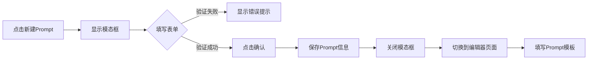

# 新建Prompt弹框功能说明

## 📋 功能概述

在全局Prompt管理页面中，点击"新建Prompt"按钮时，会弹出一个模态框，用户需要填写Prompt的基本信息后才能进入模板编辑页面。

---

## ✨ 功能特性

### 1. 弹框表单字段

| 字段名 | 类型 | 必填 | 说明 |
|--------|------|------|------|
| **PromptKey** | 文本框 | ✅ 是 | Prompt的唯一标识符，只能包含字母、数字、下划线和连字符 |
| **Prompt名称** | 文本框 | ✅ 是 | Prompt的显示名称，最多100个字符 |
| **Prompt描述** | 文本域 | ❌ 否 | Prompt的用途说明，最多500个字符 |

### 2. 表单验证规则

#### PromptKey验证
- 不能为空
- 只能包含：字母(a-z, A-Z)、数字(0-9)、下划线(_)、连字符(-)
- 长度限制：3-100个字符
- 示例：`system_default_v2`, `chat_prompt_v1`

#### Prompt名称验证
- 不能为空
- 最多100个字符

#### Prompt描述验证
- 可选字段
- 最多500个字符

---

## 🎯 使用流程

### 步骤1：点击新建按钮
在"全局Prompt列表"页面，点击右上角的"新建Prompt"按钮

```
┌─────────────────────────────────────┐
│  全局Prompt列表                      │
│                      [新建Prompt]   │
└─────────────────────────────────────┘
```

### 步骤2：填写表单信息
弹出模态框，填写Prompt的基本信息

```
┌─────────────────────────────────────┐
│  新建Prompt                    ✕    │
├─────────────────────────────────────┤
│                                     │
│  PromptKey *                        │
│  ┌───────────────────────────────┐ │
│  │ system_prompt_v1              │ │
│  └───────────────────────────────┘ │
│  用于唯一标识Prompt                │
│                                     │
│  Prompt名称 *                       │
│  ┌───────────────────────────────┐ │
│  │ 系统默认提示词                 │ │
│  └───────────────────────────────┘ │
│                                     │
│  Prompt描述                         │
│  ┌───────────────────────────────┐ │
│  │                               │ │
│  │  用于AI对话的基础提示词配置    │ │
│  │                               │ │
│  └───────────────────────────────┘ │
│  简要描述Prompt的用途和内容        │
│                                     │
├─────────────────────────────────────┤
│                   [取消]  [确认]    │
└─────────────────────────────────────┘
```

### 步骤3：确认后进入编辑页面
点击"确认"按钮后，进入Prompt模板编辑页面

```
┌─────────────────────────────────────┐
│  编辑: 系统默认提示词                │
│  用于AI对话的基础提示词配置          │
│  PromptKey: system_prompt_v1        │
│                      [新建Prompt]   │
├─────────────────────────────────────┤
│                                     │
│  Prompt 模板 *                      │
│  ┌───────────────────────────────┐ │
│  │ 你是一个专业的AI助手...       │ │
│  │                               │ │
│  └───────────────────────────────┘ │
│                                     │
└─────────────────────────────────────┘
```

---

## 🔧 技术实现

### 新增文件

1. **`CreatePromptModal.tsx`**
   - 位置：`frontend/pages/admin/globalPrompt/CreatePromptModal.tsx`
   - 功能：创建Prompt的模态框组件
   - 包含表单验证逻辑

2. **类型定义更新**
   - 文件：`frontend/pages/admin/globalPrompt/types.ts`
   - 新增：`CreatePromptFormData` 接口

### 修改文件

1. **`PromptManagement.tsx`**
   - 导入 `CreatePromptModal` 组件
   - 添加模态框状态管理
   - 处理表单确认/取消逻辑
   - 显示当前编辑的Prompt信息

2. **`PromptManagement.css`**
   - 新增模态框样式
   - 新增表单样式
   - 新增动画效果

---

## 📊 数据流



---

## 🎨 UI/UX设计

### 模态框样式

- **遮罩层**：半透明黑色背景 (rgba(0, 0, 0, 0.5))
- **内容区**：白色圆角卡片，最大宽度600px
- **动画**：
  - 遮罩层：淡入效果 (fadeIn)
  - 内容区：滑入效果 (slideIn)

### 表单元素样式

- **输入框**：圆角8px，聚焦时蓝色边框
- **必填标记**：红色星号 (*)
- **错误提示**：红色文字 (12px)
- **提示文字**：灰色文字 (12px)

### 按钮样式

- **取消按钮**：白底灰边，悬停时浅灰背景
- **确认按钮**：蓝色背景，悬停时深蓝色，带阴影

---

## 🔒 表单验证示例

### 成功案例

```typescript
{
  promptKey: "system_prompt_v1",
  name: "系统默认提示词",
  description: "用于AI对话的基础提示词配置"
}
```

### 失败案例

```typescript
// ❌ PromptKey包含非法字符
{
  promptKey: "system@prompt", // 错误：包含@
  name: "系统提示词",
  description: "描述"
}

// ❌ PromptKey太短
{
  promptKey: "ab", // 错误：少于3个字符
  name: "系统提示词",
  description: "描述"
}

// ❌ 名称太长
{
  promptKey: "valid_key",
  name: "这是一个非常非常非常非常非常非常非常非常非常非常非常非常非常非常非常非常非常非常非常非常非常非常非常长的名称", // 超过100字符
  description: "描述"
}
```

---

## 💡 使用建议

### PromptKey命名规范

推荐使用以下格式：
- `system_default_v1` - 系统默认Prompt版本1
- `chat_prompt_v2` - 聊天Prompt版本2
- `qa_template_v1` - 问答模板版本1

### Prompt名称建议

- 简洁明了，一眼能看出用途
- 例如："系统默认提示词"、"客服对话模板"、"知识库问答模板"

### Prompt描述建议

- 说明Prompt的主要用途
- 包含适用场景
- 记录重要的配置说明

---

## 🚀 后续优化方向

### 1. PromptKey唯一性验证
- 在表单提交时检查数据库中是否已存在相同的PromptKey
- 实时验证，输入时即可提示

### 2. Prompt模板预览
- 在编辑页面添加预览功能
- 实时显示Prompt的效果

### 3. 模板库
- 提供常用Prompt模板
- 用户可以基于模板快速创建

### 4. 版本管理
- 记录Prompt的修改历史
- 支持回退到历史版本

---

## 🐛 已知问题

目前没有已知问题。

---

## 📝 更新日志

### v1.0.0 (2025-03-25)
- ✅ 新建Prompt弹框功能
- ✅ 表单验证（PromptKey、名称、描述）
- ✅ 模态框UI动画效果
- ✅ 错误提示显示
- ✅ 编辑器页面显示当前Prompt信息

---

## 👥 相关人员

- **开发者**：AI Assistant
- **创建日期**：2025-03-25
- **最后更新**：2025-03-25
