# 云边双模 Agent 桌面端实施方案

> 版本：v1.0（2026-08-25）
> 范围：apps/desktop、apps/backend-ts、packages/modu-agent
> 目标产品形态：WorkBuddy / TraeWork 类——桌面端 Agent 可本地运行（边），也可切换云端运行（云）；移动端连接云端，多端共享会话。

---

## 1. 终态与原则

### 1.1 终态架构


```
桌面应用（单安装包）
├─ 渲染进程（React）
│   ├─ HttpTransport ──HTTPS/SSE──> 云端 backend-ts ──> modu-agent（云）
│   └─ IpcTransport  ──Electron IPC──> 主进程内嵌 modu-agent（边）
│                                     └─ SQLite · safeStorage · 本地文件
移动端（H5 / 小程序 / App）──HTTPS/SSE──> 云端 backend-ts
```

- **一个代码库、两条传输通道**：IPC = 边，HTTPS/SSE = 云
- **modu-agent 同一内核双宿主**：云端与边缘行为、HITL 语义、事件序列完全同源
- **backend-ts 不退役**：角色转为云形态 + 移动端后端

### 1.2 三条原则

1. **云边同源**：modu-agent 内核与 AGUI 事件协议零改动，只换投递层。
2. **会话级归属**：`ChatSession.runtime` 字段（`local` / `cloud`）决定路由；模式切换只影响新会话——HITL checkpoint（MemorySaver）存在于执行该会话的 runtime 进程内，不可跨 runtime 迁移。
3. **每阶段独立验收、可回退**：通过特性开关整体回退到纯 HTTP 模式。

---

## 2. 现状分析结论（三轮代码审读汇总）

### 2.1 当前链路



```
React 渲染进程 ──HTTP/SSE(127.0.0.1:8088)──> Fastify(backend-ts) ──进程内调用──> modu-agent ──HTTPS──> LLM/MCP/搜索
```

### 2.2 支撑改造的关键事实

| 事实 | 证据 | 对双模的意义 |
|---|---|---|
| modu-agent 不依赖 HTTP 服务器 | `runner.ts` 中 `stream_response` / `resume_stream` 均为 `async function*`，输入参数、输出事件 generator | 同一份代码既可嵌进 Electron 主进程（边），也可继续跑在 backend-ts（云） |
| 原生依赖可选 | `better-sqlite3` 仅为 optionalDependencies，`sql-query.ts` 动态 `await import`，缺失时返回 `SQL_003` 而非崩溃 | Electron 打包风险可控 |
| AGUI 事件是纯 JSON 数据对象 | `agui-adapter.ts` 事件常量与 payload 定义；前端 `agui.ts` 将 SSE 文本解析与事件分发分层 | 事件分发层对"来自 IPC 还是网络"完全无感，chatStore / hitlStore / stream-handler / 全部 UI 组件零改动 |
| backend-ts 已具备多端云后端底子 | 完整 JWT + refresh token（`auth.ts`）；User 表已有 `wechatOpenid/wechatUnionid`；`verifySessionOwner` 按 userId 隔离会话；`client.ts` 已有 `setBaseURL` 动态切换 | 移动端接入无需新后端 |
| desktop 已有 IPC 基础设施 | `ipc-handlers.ts` 已注册 `APP_NETWORK_CHECK` 等 `ipcMain.handle`；preload 通过 contextBridge 暴露安全 API 子集；sandbox / contextIsolation 已开启 | 与 WorkBuddy / Codex 一致的安全模型，直接沿用 |

### 2.3 backend-ts 职责迁移清单

| backend-ts 职责 | 边缘模式去向 |
|---|---|
| agent-bridge（streamAgentCompletion / Resume、事件转换） | 主进程直接调 `stream_response` / `resume_stream`，省掉 SSE 序列化，AGUI 事件对象直达渲染端 |
| chat 会话 / 消息持久化（Prisma） | 主进程继续跑 Prisma + SQLite（schema 复用，库文件落 `app.getPath('userData')`） |
| auth / JWT / bcrypt | 本地单用户免登录，首次启动本地建档；API key 走 `safeStorage` 加密（DPAPI / Keychain） |
| upload | `userData/uploads` + 本地文件系统 |
| verifySessionOwner（防 IDOR） | 单用户下简化为 runId 归属校验 |
| Swagger / 响应包装 / 跨域 | 删除（云端形态保留） |

---

## 3. 双模核心设计决策

### 3.1 模式切换是"会话级"而非"全局级"

- 每条 `ChatSession` 增加 `runtime` 归属字段（`local` / `cloud`）
- 切换模式只影响**新会话**的创建去向
- 已有会话的 `resume / abort / getState`（含 HITL `recover()`）按其归属路由
- UI 上会话列表标注归属（本地 / 云标识）

### 3.2 Transport 抽象（唯一的渲染端核心改造）

渲染进程定义统一 `Transport` 接口，两个实现：

- `IpcTransport`：走 preload 暴露的 IPC 通道（本地模式）
- `HttpTransport`：现有 `apiClient.stream()` 的 SSE 逻辑封装（云端模式）

两者产出同一套 `AguiStreamCallbacks` 回调，上层（chatStore / hitlStore / stream-handler / 全部 UI 组件）无感。

### 3.3 移动端只连云端

桌面端"切云端"后与移动端是同一个 backend-ts 的两个客户端，会话天然互通（同一 userId 下的 ChatSession）。

---

## 4. 实施路线图


```
阶段 0 重构铺垫 ──> 阶段 1 边缘内核 ──> 阶段 2 本地自治 ──> 阶段 3 双模成型 ──> 阶段 4 同步加固
                                    （关键路径）         并行：云端化轨道、移动端轨道
```

### 阶段 0 · 重构铺垫（零行为变化）

**目标**：把"投递方式"从渲染端业务逻辑中剥离。

改动清单：
1. 新增 `services/transport/types.ts`：定义 `Transport` 接口（`sendMessage / resume / abort / getState / subscribe`），回调签名与现有 `AguiStreamCallbacks` 完全一致
2. 将 `client.ts` 的 `stream()` 包装为 `HttpTransport`（第一个实现）
3. `chatStore.ts` 的 `sendMessage / resumeHitl / abortHitl` 改为面向 `Transport` 接口，不再直接 import apiClient
4. `schema.prisma` 的 `ChatSession` 增加 `runtime` 字段（默认 `cloud`）+ migration；本地存储预留同字段

验收：desktop typecheck + 现有流式 / HITL 冒烟全绿，HTTP 行为零变化。
回退：无需回退。

### 阶段 1 · 边缘内核（IPC 双通道并存）

**目标**：Agent 跑进 Electron 主进程，本地模式可用，HTTP 通道保持不变。

改动清单：
1. 主进程新增 `src/main/agent-runtime.ts`：
   - 封装 modu-agent 的 `stream_response / resume_stream / get_interrupt_state`
   - 遍历 generator 逐事件 `webContents.send('agent:event:<runId>', ev)`
   - **带序号的发送队列**保证 `TEXT_MESSAGE_START → ... → END` 顺序
   - AbortController 取消
2. `ipc-handlers.ts` 注册 `AGENT_COMPLETIONS / AGENT_RESUME / AGENT_ABORT / AGENT_STATE`，语义对齐 backend-ts `agent.ts` 的 REST 端点（含 HITL 三端点语义）
3. preload 暴露 `agent.invoke` + `agent.onEvent(runId)` 订阅
4. 渲染端实现 `IpcTransport`；特性开关 `TRANSPORT_MODE`（`http | ipc`）控制启用
5. desktop `package.json` 加 `"@pioneering/modu-agent": "workspace:*"`，electron-vite 主进程构建 externalize 该包
6. **并行 spike**（阶段 2 最大风险前置验证）：`electron-rebuild` + `asarUnpack` 处理 better-sqlite3 / Prisma engine 的 ABI 问题

验收：本地模式完整跑通一条会话，含 HITL 暂停 / 恢复 / 中止（hitlStore 串行队列不变）；HTTP 模式回归通过。
回退：开关切回 `http`。

### 阶段 2 · 本地自治（关键路径，断网可用）

**目标**：桌面成为自洽产品，去掉对 backend-ts 的运行时依赖。

改动清单：
1. 持久化：主进程跑 Prisma + SQLite（schema 复用，库文件落 `userData`），实现与 chat 路由等价的本地 DAO；保持"HITL interrupt 事件不落库、resume 终态落库"约定
2. 密钥：LLM / Tavily key 走 `safeStorage` 加密 + 设置 UI（对应 modu-agent `env.ts` 的读取项）
3. 上传：写入 `userData/uploads`
4. auth：本地模式免登录（本地单用户档案）
5. 打包：electron-builder 补 `asarUnpack`、外部化原生模块（阶段 1 spike 结论落地）

验收：断网环境安装包在干净机器完整可用；本地 HITL 会话在窗口刷新 / 重开后 `recover()` 正常。
回退：失败不影响阶段 1 成果（仍可 HTTP 模式运行）。

### 阶段 3 · 双模成型

**目标**：云边可切换，移动端接入云端。

改动清单：
1. UI：新建会话时选择模式；会话列表标注 `local / cloud` 归属；ChatArea / InputArea 零改动（事件同源）
2. 路由：`resume / abort / getState` 按 `ChatSession.runtime` 分发到对应 Transport；HITL `recover()` 同理
3. 云端：backend-ts 的 `build_checkpointer` 切 sqlite 模式（`factory.ts` 已支持，纯配置变更），解决云端进程重启丢 HITL 状态
4. 协议：AGUI 事件增加 `version` 字段，约定"只增字段不删字段"的兼容窗口
5. 密钥双轨：模式切换时 Transport 同时切换凭据域；云端模式渲染进程不持有任何 key

验收：桌面云模式与移动端同一账号看到同一会话列表；本地暂停的 HITL 会话 resume 正确路由回本地主进程。
回退：模式切换 UI 由开关控制，默认隐藏。

### 阶段 4 · 同步加固

**目标**：体验闭环与稳定性。

改动清单：
1. 本地→云单向同步：本地会话到达终态后，将最终消息同步为云端 `ChatMessage`（结构直接复用）；**进行中流式与 HITL 状态不同步**（checkpoint 无法跨 runtime 序列化迁移）
2. utilityProcess 拆分：agent 从主进程迁入 utilityProcess，崩溃隔离（视阶段 1-3 稳定性决定是否做）
3. 多端 HITL 感知：`/state/:threadId` 轮询或推送，让另一端感知暂停态已被消费
4. 移动端：独立客户端，复用云端 auth + SSE，可与阶段 3 并行启动

---

## 5. 风险与对策

| 风险 | 等级 | 对策 |
|---|---|---|
| 原生模块 ABI（better-sqlite3 / Prisma engine） | 高 | 阶段 1 期间 spike 前置验证，干净虚拟机验证安装包 |
| IPC 事件乱序 / 背压 | 中 | 主进程序号队列 + 渲染端按序消费 |
| 协议版本漂移（桌面与云端发版节奏不同） | 中 | `version` 字段 + 只增不改约束 |
| 双模状态泄漏（key / 登录态串） | 中 | Transport 切换时同步切换凭据域，云端模式渲染端零密钥 |
| 云端多实例 checkpoint 路由 | 低（单实例起步） | SqliteSaver 先行；多实例时按 sessionId 粘性路由，后置 |

---

## 6. 明确不做的事

- **不退役 backend-ts**——角色转为云形态 + 移动端后端，而非删除
- **不做双向实时同步**——技术上不可行（checkpoint 跨 runtime 不可迁移），只做终态单向同步
- **不做全局模式切换**——只做会话级归属，避免 HITL 路由歧义
- **utilityProcess 不提前拆**——阶段 4 视稳定性决定，先在主进程跑通

---

## 7. 工作量判断

所有阶段的 modu-agent 内核改动量接近零（其"纯库 + async generator + 标准事件协议"设计是根本杠杆），工作量集中在三处：

1. 渲染端 Transport 抽象 + 会话归属路由
2. Electron 工程化（原生模块 rebuild / asarUnpack / safeStorage / 打包验证）
3. 数据层迁移（本地 Prisma + SQLite DAO）与云端配置调整

阶段 0 + 阶段 1 即可获得"本地可跑的 Agent"；阶段 2 获得"可发布的产品"；阶段 3 进入双模；阶段 4 完成体验闭环。
