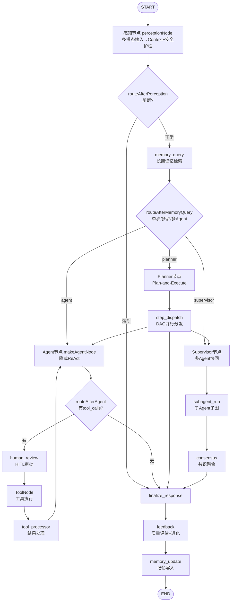

# Agent 认知循环五阶段实现分析报告

> 分析对象：`packages/modu-agent`
> 分析维度：感知 → 记忆 → 推理/规划/决策 → 执行 → 记忆更新
> 基于源码实际实现，标注代码位置，区分"已实现 / 弱实现 / 缺失"，并对缺失项给出优化实施方案。

---

## 0. 概述

`modu-agent` 的认知循环基于 **LangGraph StateGraph** 构建，将原 Python `Coordinator` "上帝类"拆解为图节点编排。整体流程如下：

**主图构建位置**：[graph.ts](file:///Users/ybxue/Desktop/pioneering/packages/modu-agent/src/graph/graph.ts) `buildModuGraph()`（L335-672）

**状态定义**：[state.ts](file:///Users/ybxue/Desktop/pioneering/packages/modu-agent/src/graph/state.ts) `ModuAgentStateAnnotation`（L161-271），状态字段分层为 CoreState / HITLModeState / MultiAgentModeState / PlanExecuteModeState / FeedbackModeState。

**整体特征**：架构设计完整，五阶段在图结构上均有节点承载；但感知阶段运行时存在"空转"问题，记忆阶段 embedding 降级，部分反馈闭环未接通。下文逐阶段分析。

---

## 1. 感知阶段

### 1.1 多模态输入转化为 Context、意图提取

**感知管线入口**：[pipeline.ts](file:///Users/ybxue/Desktop/pioneering/packages/modu-agent/src/perception/pipeline.ts)

- `runPerceptionPipelineAsync()`（L135-200）：异步并行版本。第一个感知器串行执行建立文本基线，后续感知器用 `Promise.all` 并行，失败用 `_perceiveSafe` 吞异常。
- `_resolvePipeline()`（L26-34）：从 `perception.routing[inputType].pipeline` 读取感知器名链，默认 `['text_preprocessor']`。
- `_fuseResults()`（L37-52）：单结果直接返回；多结果用 `PerceptionFusion` 融合。

**多模态融合**：[fusion.ts](file:///Users/ybxue/Desktop/pioneering/packages/modu-agent/src/perception/fusion.ts)

`PerceptionFusion` 类（L30-241）实现三种融合策略：
- `weighted_average`（默认）：按模态权重 `{text:0.5, image:0.3, audio:0.2}` 加权 confidence/quality/security_score，合并文本、实体、metadata，调用 `_mergeIntent`/`_mergeSentiment` 合并语义字段。
- `max_confidence`：取置信度最高的结果。
- `voting`：对 sensitivity_level 做多数投票。

**文本感知 — 规则匹配（最完整组件）**：[text/rule-based.ts](file:///Users/ybxue/Desktop/pioneering/packages/modu-agent/src/perception/text/rule-based.ts)

`TextPreprocessor`（L174-832）实现：
- 敏感词分级（L19-58）：0-5 级（safe/notice/sensitive/high_risk/review/block），覆盖密码明文、身份证、银行卡、护照、转账支付等。
- 上下文降级（L65-84）：命中敏感词但出现"丢了/挂失/忘记"等求助场景时降级，降低误伤。
- 文本清洗（L100-156、L489-600）：过滤双向控制字符（防 RTL 注入）、零宽字符、压缩重复字符。
- 智能截断（L314-447）：句子边界感知 + JSON 感知截断。
- 语种检测（L112-135、L607-674）：基于 Unicode 区间计数，支持 zh/ja/ko/ar/ru/th/en。
- `perceive` 主流程（L201-282）：解码+截断 → 清洗 → 语种检测 → 敏感词检测 → 安全检测 → 质量评估 → 置信度计算。**intent/entities/sentiment 在此层均为 null**（注释标明 P1 后续填充）。

**文本感知 — LLM 解析（意图提取）**：[text/llm-parser.ts](file:///Users/ybxue/Desktop/pioneering/packages/modu-agent/src/perception/text/llm-parser.ts)

`LLMParser`（L105-390）负责深度语义理解：
- **意图解析方式为 LLM zero-shot 分类**（非规则匹配）。`_INTENT_PROMPT`（L40-49）要求 LLM 返回 JSON `{intent, confidence, entities, sentiment}`，意图类别参考 question/request/command/complaint 等。
- 本地 NER（spaCy）和情感检测（SnowNLP）在 TS 版**始终不可用**（`_SPACY_AVAILABLE=false`、`_SNOWNLP_AVAILABLE=false`），`_extractEntitiesSpacy` 始终返回 `[]`。
- `_callLlmSafe`（L165-259）用低温度 0.3 调用 LLM，超时/失败返回 null 不阻塞；`_parseJsonResponse` 兼容 markdown fence 与子串提取。

**视觉感知（stub）**：[vision/image-processor.ts](file:///Users/ybxue/Desktop/pioneering/packages/modu-agent/src/perception/vision/image-processor.ts)

`ImageProcessor`（L41-226）：Base64/magic bytes 解码完整（L167-195），但 `_extractText`（L198-216）**始终返回空字符串**，OCR 实现为 TODO。注释建议引入 `tesseract.js` 或云端 OCR API。

[vision/camera.ts](file:///Users/ybxue/Desktop/pioneering/packages/modu-agent/src/perception/vision/camera.ts)：`CameraSensor` 因无 OpenCV 等价库，`capture` 始终返回空字节。`TimerSensor`（L129-152）是唯一真正可用的传感器。`MicrophoneSensor` 同样为 stub。

**音频感知（stub）**：[audio/asr-processor.ts](file:///Users/ybxue/Desktop/pioneering/packages/modu-agent/src/perception/audio/asr-processor.ts)

`AudioProcessor`（L49-277）：格式检测（wav/mp3/m4a/flac/ogg）和临时文件管理完整，但 `_transcribeWithWhisper`/`_transcribeWithSr` 始终返回 null，ASR 实质不可用。建议接入 OpenAI Whisper API。

**感知节点接入 LangGraph**：[nodes.ts](file:///Users/ybxue/Desktop/pioneering/packages/modu-agent/src/graph/nodes.ts)

- `_buildPerceptionResult`（L97-135）：把融合结果映射为 state 更新（`perception_result/cleaned_text/sensitivity_level/confidence/detected_language/injection_detected/pii_detected`）。
- `perceptionNode`（L144-154）：调用 `runPerceptionPipelineAsync`。

### 1.2 输入侧安全护栏

**SecurityGuard**：[security/guard.ts](file:///Users/ybxue/Desktop/pioneering/packages/modu-agent/src/perception/security/guard.ts)

`SecurityGuard` 类（L96-395），仅依赖标准库正则：

- **Prompt Injection 模式库**（L19-34）：14 条正则，覆盖中文"忽略以上指令"、英文 `ignore previous instructions`、角色越狱 `DAN/AIM/jailbreak`、Prompt 泄露 `reveal your system prompt`、`<|im_start|>` token 特征等。
- `detectInjection(text)`（L104-119）：纯规则匹配，返回 `{detected, matched_patterns, risk_level}`，risk_level 0-3。
- `detectInjectionWithLLMJudge(text, llmJudge, riskThreshold=1)`（L139-175）：**LLM-based 注入二次校验**。策略：先跑关键词检测；若 `risk_level >= riskThreshold` 直接返回（省成本）；否则调用注入的 `llmJudge` 回调做语义级判定。LLM 调用失败回退到关键词结果。
- **PII 检测**（L40-46、L183-200）：覆盖 phone_cn/id_card_cn/bank_card/email/ipv4，命中后脱敏。
- **注入风险标记**（L52-56、L208-224）：覆盖 html_tag/sql_keyword/shell_meta，**标记不拒绝**。
- `sanitize`（L232-235）：**当前仅标记不修改原文**，返回 `[text, riskInfo]` 供调用方决策。
- `computeSecurityScore`（L247-277）：权重 = Injection 40% + PII 25% + 注入风险 20% + 敏感词 15%。
- **输出侧检测**（L312-395）：`detectOutputSensitive`/`sanitizeOutput` 检测密钥（AWS/GitHub/JWT/PEM）、内网 IP，脱敏返回。

**安全审计**：[security/audit.ts](file:///Users/ybxue/Desktop/pioneering/packages/modu-agent/src/perception/security/audit.ts)

- `AuditEventType`（L25-37）：12 种事件类型枚举（prompt_injection_blocked/pii_detected/ssrf_blocked/tool_approval_required 等）。
- `publish_security_audit_event(ctx)`（L71-114）：通过 EventBus 发布，`deny`→CRITICAL，`allow`→NORMAL，`audit`→HIGH。发布失败静默 catch。

**安全配置**：[runtime-config.ts](file:///Users/ybxue/Desktop/pioneering/packages/modu-agent/src/config/runtime-config.ts)（L176-215）

- `perception.security.enable_guard: true`（默认启用）
- `block_on_injection: false`、`block_on_pii: false`（**默认不阻断，仅标记**）
- `llm_judge.enabled: false`（**默认关闭** LLM 二次校验）

### 1.3 感知阶段小结

| 能力 | 状态 | 说明 |
|------|------|------|
| 感知管线框架（路由+链式+融合） | ✅ 已实现 | pipeline.ts 含同步/异步两版 |
| 文本规则感知器 | ✅ 已实现（质量高） | 分级、上下文降级、JSON 感知截断、语种检测 |
| 意图提取（LLM zero-shot） | 🟡 弱实现 | 框架完整但本地降级不可用，依赖 LLM 注入 |
| 视觉 OCR | ❌ 缺失（stub） | 解码完整但 _extractText 始终返回空 |
| 音频 ASR | ❌ 缺失（stub） | 格式检测完整但转写始终返回 null |
| 安全护栏（规则） | ✅ 已实现（质量高） | 14 条注入正则 + PII + 输出脱敏 |
| 安全护栏（LLM Judge） | 🟡 未接入主流程 | 代码已实现但默认关闭，无调用点 |
| 安全审计事件发布 | 🟡 未联动 | 基础设施就位但拦截点未调用 |

**最严重问题**：感知组件**从未被实例化和注册到 registry**（全代码库 grep `new TextPreprocessor`/`registerPerception(` 在 src 下零命中）。导致 `pipeline.ts` 的 `registry.getPerception()` 始终返回 undefined，整个感知阶段在运行时是**空转**的——`perceptionNode` 回退到原始 prompt 不做任何处理。这是结构性缺失。

### 1.4 优化实施方案

1. **补装配层（P0）**：在 [factory.ts](file:///Users/ybxue/Desktop/pioneering/packages/modu-agent/src/graph/factory.ts) `create_agent()` 中增加感知组件注册：
   - `registry.registerPerception('text_preprocessor', new TextPreprocessor())`
   - `registry.registerPerception('llm_parser', new LLMParser(llmAdapter))`
   - `registry.registerSensor('timer', new TimerSensor())`
   - gated by `perception.enabled` 配置，零侵入。

2. **接入安全阻断决策（P1）**：在 `perceptionNode` 中读取 `block_on_injection`/`block_on_pii` 配置，命中后路由到 `finalize_response`（熔断），并调用 `publish_security_audit_event` 发布 deny 事件。

3. **接入 LLM Judge（P1）**：将 `detectInjectionWithLLMJudge` 接入主流程，`llm_judge.enabled=true` 时自动注入 `ModuLLM` 作为 judge。

4. **引入 tesseract.js（P2）**：替换 `ImageProcessor._extractText` 的 stub，实现真实 OCR。

5. **接入 Whisper API（P2）**：替换 `AudioProcessor._transcribeWithWhisper`，调用 OpenAI Whisper API。

---

## 2. 记忆检索阶段

### 2.1 记忆检索机制

**接口抽象**：[memory.ts](file:///Users/ybxue/Desktop/pioneering/packages/modu-agent/src/core/interfaces/memory.ts)

`BaseMemory`（L8-20）仅定义 `query(userId, contextWindow, requiredFields)` 与 `update(userId, newData, metadata)` 两个方法，**未定义** rerank、multi-recall、namespace 等高级能力。

**长期记忆（Chroma 向量库）**：[chroma.ts](file:///Users/ybxue/Desktop/pioneering/packages/modu-agent/src/memory/chroma.ts)

`ChromaLongTermMemory`（L61-307）：

- **Embedding 方式 —— 哈希嵌入，非语义嵌入**（L24-46、L160-175）：
  - `_simpleHashEmbedding(text, dim)`（L24-46）：用 SHA-256 迭代哈希生成 384 维向量再 L2 归一化。相同文本得相同向量，但**语义相近的文本得不到相近向量**——本质是"高级关键词哈希"。
  - `_initEmbeddingFunction()`（L160-175）：注释明确说明 TS 运行时无 SentenceTransformer/ONNX 等价库，**直接降级为 hash embedding**，`_useSemanticEmbedding=false`。
  - `setEmbeddingFunction(fn, dim)`（L185-190）：留有外部注入语义嵌入的口子（如 `@xenova/transformers`），但**全代码库无任何调用方注入**。

- **集合隔离**（L196-203）：collection 名 = `${collectionPrefix}_${userId}`，使用 `cosine` 距离度量，按 userId 物理隔离。
- **查询逻辑**（L205-264）：`collection.query({ queryEmbeddings, nResults })`，`relevance_score = 1 - distance`，topK 默认 5。
- **`last_` 短路**（L210-213）：通过原生接口传 `contextWindow='last_5_turns'` 时长期记忆直接返回空（有意设计）。

**短期记忆（工作记忆）**：[short-term-memory.ts](file:///Users/ybxue/Desktop/pioneering/packages/modu-agent/src/memory/short-term-memory.ts)

`InMemoryShortTermMemory`（L19-114）：
- 存储结构 `Map<userId, entries>`，`maxTurns=5`、`ttlSeconds=3600`。
- 滑动窗口（L74-78）：超过 `maxTurns*2` 保留最后 `maxTurns*2` 条。
- TTL 惰性淘汰（L84-103）：query 时过滤过期条目。
- **重要发现**：该类在主循环中**实际未被使用**。短期历史完全由 LangGraph Checkpointer 托管（[factory.ts](file:///Users/ybxue/Desktop/pioneering/packages/modu-agent/src/graph/factory.ts) L79-107 `build_checkpointer`：MemorySaver/SqliteSaver，按 thread_id 持久化整个 State）。

**Store 适配器（桥接层）**：[store-adapter.ts](file:///Users/ybxue/Desktop/pioneering/packages/modu-agent/src/graph/adapters/store-adapter.ts)

`ChromaStore`（L49-272）将 `ChromaLongTermMemory` 包装为 LangGraph `BaseStore`，namespace 数组 `[userId, 'knowledge']` 首元素作为 userId。

**主循环中的记忆接入**：[nodes.ts](file:///Users/ybxue/Desktop/pioneering/packages/modu-agent/src/graph/nodes.ts)

- `makeMemoryQueryNode(store)`（L196-225）：`store.search([userId, 'knowledge'], {query: cleanedText, limit: 5})`，命中项收集到 `knowledge` 数组。
- 知识注入 LLM 上下文（L455-469，在 `makeAgentNode` 内）：作为 `SystemMessage`（`Relevant knowledge from memory:\n${knowledgeText}`）插入消息列表头部。
- `makeMemoryUpdateNode(store)`（L249-322）：遍历 messages 拼成文本，`store.put([userId, 'history'], key, {...})`。

### 2.2 RAG 多路召回 / 重排序 / 摘要压缩 / 向量路由

| 能力 | 状态 | 证据 |
|------|------|------|
| **RAG 多路召回** | ❌ 缺失 | 仅 Chroma 单路向量检索，无 BM25/关键词/实体召回，无混合检索 |
| **Reranker 重排序** | ❌ 缺失 | 无 cross-encoder，Chroma 距离原序直接使用 |
| **历史对话摘要压缩** | ❌ 缺失 | `enable_compression` 配置项存在（runtime-config.ts L62）但 memory 层与 nodes.ts 均不读取，无 LLM summarizer 节点 |
| **向量路由** | ❌ 缺失 | `routeAfterMemoryQuery`（nodes.ts L1141-1178）按配置标志路由，与检索结果无关 |

### 2.3 记忆权限与数据隔离

| 能力 | 状态 | 说明 |
|------|------|------|
| 用户级隔离 | ✅ 已实现 | chroma.ts L196-203 按 userId 分 collection |
| 租户级隔离 | ❌ 缺失 | 无 tenant_id 字段，仅 userId 单维 |
| 读写权限控制 | ❌ 缺失 | BaseMemory 无鉴权参数，任何调用方可读写任意 userId 记忆 |
| namespace 二维隔离 | 🟡 弱实现 | `[userId, 'knowledge']` 与 `[userId, 'history']` 在 Chroma 同一 collection 混存 |
| `listNamespaces` | ❌ stub | store-adapter.ts L253-261 返回空数组 |

### 2.4 记忆检索阶段小结

| 能力 | 状态 |
|------|------|
| 长期记忆向量存储（ChromaDB） | ✅ 已实现 |
| 用户级数据隔离 | ✅ 已实现 |
| 主循环记忆查询/更新接入 | ✅ 已实现 |
| Checkpointer 短期历史托管 | ✅ 已实现 |
| 真正的语义 Embedding | 🟡 弱实现（降级为 hash） |
| RAG 多路召回 | ❌ 缺失 |
| Reranker 重排序 | ❌ 缺失 |
| 历史对话摘要压缩 | ❌ 缺失 |
| 向量路由 | ❌ 缺失 |
| 租户隔离 / RBAC | ❌ 缺失 |

**关键风险**：哈希嵌入导致"伪语义检索"——cosine 相似度反映字符级哈希碰撞而非语义相似度，召回质量远低于真语义检索，且接口透明不易察觉。

### 2.5 优化实施方案

1. **接入语义 Embedding（P0）**：在 [factory.ts](file:///Users/ybxue/Desktop/pioneering/packages/modu-agent/src/graph/factory.ts) 中调用 `chroma.setEmbeddingFunction()`，注入 `@xenova/transformers` 的 `all-MiniLM-L6-v2` 模型（纯 JS 运行时，无需 Python）。

2. **RAG 多路召回 + Reranker（P1）**：
   - 增加 BM25 关键词召回路（如 `wink-bm25-text-search` 纯 JS 库），与向量召回并行。
   - 增加轻量 reranker：用 LLM 对 top-K 候选做相关性二次打分（`@xenova/transformers` 的 cross-encoder 模型，或 LLM-as-Judge）。

3. **历史对话摘要压缩（P1）**：新增 `summarize_node`，当 `messages.length > threshold` 时用 LLM 生成摘要 SystemMessage 替换旧消息。读取已有的 `memory.enable_compression` 配置。

4. **向量路由（P2）**：在 `routeAfterMemoryQuery` 中增加基于检索结果质量（如最高 relevance_score）的路由分支：低质量召回 → 触发 web_search 工具补充。

5. **多租户隔离 + RBAC（P2）**：
   - collection 命名升级为 `${prefix}_${tenantId}_${userId}`。
   - metadata 增加 `readable_by`/`writable_by` 字段，`ChromaStore.search/put` 增加权限校验回调。

---

## 3. 推理/规划/决策阶段

### 3.1 推理框架注入（ReAct / Plan-and-Execute / Reflection / Few-shot）

**Plan-and-Execute 框架（完整实现）**：[plan-execute/](file:///Users/ybxue/Desktop/pioneering/packages/modu-agent/src/graph/plan-execute/)

- [prompts.ts](file:///Users/ybxue/Desktop/pioneering/packages/modu-agent/src/graph/plan-execute/prompts.ts)：
  - `buildToolCatalogText()`（L30-49）：工具清单转文本，对 `providesRealtimeData()=true` 的工具前缀 `[realtime]` 标签。
  - `buildPlannerSystemPrompt()`（L59-107）：Planner 主提示词，约束产出最多 `maxSteps` 步骤、严格 JSON、`requires_tool` 字段、`task_type` 枚举（reasoning/tool_use/delegation）。**无 Few-shot**。
  - `buildPlannerSystemPromptCompact()`（L122-154）：重试专用简洁版，**含 one-shot GOOD/BAD 对照示例**。
  - `buildReplanContext()`（L168-199）：构建重规划上下文（已完成步骤摘要 + 失败步骤原因），支持**部分重规划**（仅重生成失败步骤）。

- [planner.ts](file:///Users/ybxue/Desktop/pioneering/packages/modu-agent/src/graph/plan-execute/planner.ts)：
  - `_tryStructuredOutput()`（L375-410）：**withStructuredOutput 使用点**，优先用 LangChain `llm.withStructuredOutput(PlanSchema)` 让 LLM 按 zod schema 输出，失败降级 JSON-in-text。
  - `_parsePlan()`（L230-308）：`requires_tool` 推断优先级 = 引用实时工具 > LLM 显式输出 > 元数据+关键词兜底。
  - `makePlannerNode()`（L422-678）：三阶段调用：attempt 0 = 完整提示词 + withStructuredOutput → attempt 1 = 简洁提示词 + 减半 maxSteps + temperature=0 → 仍失败返回空 plan 降级直答。

**ReAct 框架（隐式实现）**：[nodes.ts](file:///Users/ybxue/Desktop/pioneering/packages/modu-agent/src/graph/nodes.ts)

- `makeAgentNode()`（L413-536）：**ReAct 通过 LangGraph 原生 function calling 实现，无显式 "Thought: ... Action: ..." 文本解析**。LLM 通过 `bindTools` 自行决定是否产出 `tool_calls`。
- `routeAfterAgent()`（L375-395）：检查 AIMessage 的 `tool_calls`——有 → `tools`（ReAct 循环）；无 → 结束。
- ReAct 循环边：[graph.ts](file:///Users/ybxue/Desktop/pioneering/packages/modu-agent/src/graph/graph.ts) L592-593 `tools → tool_processor → agent`。

**Reflection 反思机制（失败驱动 + 后置评估）**：

- **失败驱动重规划**：[dispatcher.ts](file:///Users/ybxue/Desktop/pioneering/packages/modu-agent/src/graph/plan-execute/dispatcher.ts) `stepDispatch()`（L146-257）中，`step_finalize` 检测到 `lastResult.status==='failed'` 且 `continue_on_failure=false` 时，若 `replan_count < max_replans`（默认 2）→ 路由到 `planner`，携带失败上下文触发重规划。
- **后置质量评估**：[feedback/loop-controller.ts](file:///Users/ybxue/Desktop/pioneering/packages/modu-agent/src/feedback/loop-controller.ts) `FeedbackLoop.shouldEvolve()`（L118-138）：样本量 ≥ 10 且最近窗口 60%+ 的 `quality_score` 低于阈值时触发进化。**这是统计层反思，非单次自批判**。
- [quality-monitor.ts](file:///Users/ybxue/Desktop/pioneering/packages/modu-agent/src/feedback/quality-monitor.ts) `QualityMonitor`（L36-632）：支持 `rule`/`llm`/`hybrid` 三模式，LLM Judge 五维评估（relevance/completeness/accuracy/confidence/tool_success）。

**Few-shot 示例**：

- [skills/adapter.ts](file:///Users/ybxue/Desktop/pioneering/packages/modu-agent/src/skills/adapter.ts) `SkillAdapter.promptFragment()`（L35-57）：构建含 few-shot examples 的提示片段。
- [skills/math-skill.ts](file:///Users/ybxue/Desktop/pioneering/packages/modu-agent/src/skills/math-skill.ts) `MathSkill.examples()`（L28-33）：提供 2 条 few-shot 示例。
- [prompt-aggregator.ts](file:///Users/ybxue/Desktop/pioneering/packages/modu-agent/src/skills/prompt-aggregator.ts) `SkillPromptAggregator.aggregate()`（L24-47）：合并 base prompt + 所有 Skill 提示片段。

**共识模式**：[orchestration/patterns/consensus.ts](file:///Users/ybxue/Desktop/pioneering/packages/modu-agent/src/orchestration/patterns/consensus.ts)

- `MajorityVoteStrategy`（L65-156）：v1.4 改用 Jaccard 词元相似度（阈值 0.6）替代严格内容哈希分组。
- `WeightedAggregateStrategy`（L162-194）：按 task_type 权重排序取最优。
- `LLMJudgeStrategy`（L200-281）：LLM 裁决选择最佳候选，含失败重试 1 次。
- `ConsensusPattern.reach_consensus()`（L336-420）：校验 quorum、并行调用 participants（`Promise.allSettled` + 超时）。

### 3.2 上下文组装（环境状态 + 工具描述 + 参数 Schema）

**工具清单描述注入**：

- Planner 侧：`buildToolCatalogText()` 将工具清单转为 `- [realtime] tool_name: description` 文本（描述截断 200 字符）。
- Agent 侧：通过 `bindTools` 注入工具 schema（见 3.3）。

**参数 Schema 与 withStructuredOutput**：

- [tool-adapter.ts](file:///Users/ybxue/Desktop/pioneering/packages/modu-agent/src/graph/adapters/tool-adapter.ts) `_schema_to_zod()`（L42-97）：**JSON Schema → Zod schema 转换**，供 `DynamicStructuredTool.schema` 使用，LangChain 在调用前用 Zod 强校验参数。
- [types.ts](file:///Users/ybxue/Desktop/pioneering/packages/modu-agent/src/graph/plan-execute/types.ts) `PlanSchema`（L80-97）：zod schema，含 goal + steps（1-20 步）。

**环境状态注入**（[nodes.ts](file:///Users/ybxue/Desktop/pioneering/packages/modu-agent/src/graph/nodes.ts) `makeAgentNode`）：

- 感知上下文（L443-453）：`perception_result` 提取为 `SystemMessage`。
- 长期知识（L456-469）：`knowledge` 转为 `Relevant knowledge from memory` SystemMessage。
- Plan-Execute 步骤上下文：[context.ts](file:///Users/ybxue/Desktop/pioneering/packages/modu-agent/src/graph/plan-execute/context.ts) `makePlanContextInjector()`（L27-84）产出 SystemMessage 注入当前步骤信息 + 前序步骤摘要 + 防重复约束。

### 3.3 状态与编排控制

**主图构建**：[graph.ts](file:///Users/ybxue/Desktop/pioneering/packages/modu-agent/src/graph/graph.ts) `buildModuGraph()`（L335-672）

- 节点注册（L440-474）：perception / memory_query / agent / tools / tool_processor / finalize_response / feedback / memory_update / human_review / supervisor / subagent_run / consensus / planner / step_dispatch / step_finalize。
- 组合模式（plan_execute + multi_agent）：plan_execute 优先入口，`task_type=delegation` 步骤路由到 supervisor。
- `recursionLimit` 动态计算（L617-658）：基础 = `maxIterations*3 + 7`，HITL +2，multi_agent +4，plan_execute 按步骤数动态累加。

**单步 vs 多步决策**：[nodes.ts](file:///Users/ybxue/Desktop/pioneering/packages/modu-agent/src/graph/nodes.ts) `routeAfterMemoryQuery()`（L1141-1178）

优先读取 `orchestration.mode_router` 配置规则；无规则命中时按默认优先级：`multi_agent.enabled` → supervisor；`plan_execute.enabled` → planner；否则 → agent（单步 ReAct）。

**规划-反思-重规划触发**：[dispatcher.ts](file:///Users/ybxue/Desktop/pioneering/packages/modu-agent/src/graph/plan-execute/dispatcher.ts)

- `stepDispatch()`（L146-257）：决策逻辑——全部步骤完成 → response；本代际末步失败且 `continue_on_failure=false`：`replan_count < max_replans` → planner（触发重规划），否则 → response。
- **DAG 并行调度**：`_identifyReadySteps()`（L286-303）识别就绪步骤集合（pending 且 depends_on 全 done），集合大小>1 时通过 LangGraph **Send API** 并行分发。
- `makeStepFinalizeNode()`（L353-588）：**步骤级重试**（指数退避），失败判定（requires_tool 但未调工具 → failed；工具全失败但有降级输出 → degraded）。

**多 Agent 协同路由**：[subgraph/supervisor.ts](file:///Users/ybxue/Desktop/pioneering/packages/modu-agent/src/graph/subgraph/supervisor.ts)

- `decompose_task_with_llm()`（L128-195）：**v1.4 LLM 驱动任务拆分**，引导 LLM 拆分为有依赖关系的子任务，失败 fallback 到规则化拆分。
- `make_supervisor_node()`（L218-282）：检测 `need_help` 信号触发重新拆分。
- `route_from_supervisor()`（L301-333）：返回 `Send[]` 并行分发子任务，过滤出无依赖或依赖已完成的子任务。
- [builder.ts](file:///Users/ybxue/Desktop/pioneering/packages/modu-agent/src/graph/subgraph/builder.ts) `build_subagent_subgraph()`（L75-188）：子 Agent 独立编译子图，独立 `recursion_limit`（默认 10，不计入主图预算）。
- [nodes.ts](file:///Users/ybxue/Desktop/pioneering/packages/modu-agent/src/graph/nodes.ts) `makeSubagentNode()`（L1229-1397）：按 task_type 过滤工具（research→search/http，coding→calculator/code_executor，review→无工具），超时控制（默认 30s），失败重试（默认 1 次）。

### 3.4 推理/规划/决策阶段小结

| 能力 | 状态 | 说明 |
|------|------|------|
| Plan-and-Execute 框架 | ✅ 已实现 | Planner + dispatcher + 重规划 + 部分重规划 + DAG 并行 + 步骤级重试 |
| 隐式 ReAct（原生 function calling） | ✅ 已实现 | 通过 bindTools + tool_calls 路由，无文本解析 |
| Reflection（失败驱动重规划） | ✅ 已实现 | 失败步骤 error + 已完成步骤摘要注入重规划上下文 |
| Reflection（后置质量评估） | ✅ 已实现 | QualityMonitor rule/llm/hybrid + FeedbackLoop 统计触发 |
| Few-shot（Skill 机制） | ✅ 已实现 | 接口 + 聚合器 + 示例 Skill |
| Few-shot（Planner one-shot） | ✅ 已实现 | 重试时含 GOOD/BAD 对照 |
| withStructuredOutput | ✅ 已实现 | Planner 优先使用，失败降级 JSON-in-text |
| 共识模式 | ✅ 已实现 | MajorityVote(Jaccard) + Weighted + LLMJudge(含重试) |
| 多 Agent 协同 | ✅ 已实现 | LLM 拆分 + Send 并行 + 子图隔离 + 工具过滤 + 超时重试 |
| 组合模式（Plan-Execute + multi_agent） | ✅ 已实现 | delegation 步骤路由到 supervisor |
| Tree of Thoughts (ToT) | ❌ 缺失 | 无分支探索、无思维树回溯 |
| 显式 ReAct Prompt（Thought/Action 文本） | ❌ 未实现（设计选择） | 现代化设计，无文本解析 |
| 动态反思触发（单请求内自批判） | 🟡 弱实现 | 仅失败驱动 + 跨请求统计，无 Self-Refine |
| expected_output 语义校验 | 🟡 弱实现 | 字段已定义但 step_finalize 未实际使用 |

### 3.5 优化实施方案

1. **Self-Refine 反思节点（P1）**：在 `finalize_response` 前增加 `self_refine` 节点，让 LLM 自评输出质量（读取 `expected_output`/`verification_hint` 做语义校验），低于阈值时自我改进一次。这是当前最显著的缺口——`expected_output`/`verification_hint` 字段已定义但未用于校验。

2. **Tree of Thoughts（P2）**：针对复杂推理步骤，在 Planner 中增加 ToT 模式选项——生成多个候选步骤，用 LLM 评估各路径前景，选择最优分支。可作为 Plan-Execute 的可选增强（gated by `plan_execute.tot_enabled`）。

3. **修复 supervisor_round 运算符优先级 bug（P0）**：[supervisor.ts](file:///Users/ybxue/Desktop/pioneering/packages/modu-agent/src/graph/subgraph/supervisor.ts) L256 `(state as any)['supervisor_round'] ?? 1 + 1` 实际为 `?? (1 + 1)`，应改为 `((state as any)['supervisor_round'] ?? 1) + 1`，并增加 `supervisor_max_rounds` 上限检查。

4. **PlanStep 增加 estimated_iterations 字段（P2）**：当前 `recursionLimit` 动态计算因 PlanStep 未产出 `estimated_iterations` 而失效，回退到粗略估算。在 PlanSchema 中增加该字段并让 Planner 输出。

---

## 4. 执行阶段

### 4.1 工具调用安全沙箱与危险操作防护

**核心接口**：[action.ts](file:///Users/ybxue/Desktop/pioneering/packages/modu-agent/src/core/interfaces/action.ts)

- `requiresApproval()`（L39-41）：静态敏感性判定。
- `requiresApprovalFor(params, context)`（L56-61）：**动态参数级敏感性判定**（如 file_ops 读取不需审批、写入需审批；http_request 命中内网 IP 才需审批）。
- `onApprovalRejected(params)`（L67-73）：审批拒绝降级结果。
- `providesRealtimeData()`（L92-94）：声明工具是否提供实时数据，Planner 据此推断 `requires_tool`。
- `followUpTools()`（L135-137）：推荐后续工具（如 search → http_request）。

**各工具安全防护**：

| 工具 | 文件 | 安全防护 |
|------|------|----------|
| CalculatorTool | [calculator.ts](file:///Users/ybxue/Desktop/pioneering/packages/modu-agent/src/tools/calculator.ts) | 字符白名单 + 手写递归下降解析器（L127-232），完全避免 eval() 注入 |
| DateTimeTool | [datetime-tool.ts](file:///Users/ybxue/Desktop/pioneering/packages/modu-agent/src/tools/datetime-tool.ts) | 纯计算无 IO，`providesRealtimeData()=true` |
| FileOpsTool | [file-ops.ts](file:///Users/ybxue/Desktop/pioneering/packages/modu-agent/src/tools/file-ops.ts) | 工作目录约束 + 路径穿越防护（L138-171）+ 符号链接检测 + **仅允许删除文件禁止删除目录**（L276-298）+ 动态审批（read/list 不需，write/delete 需审批） |
| SqlQueryTool | [sql-query.ts](file:///Users/ybxue/Desktop/pioneering/packages/modu-agent/src/tools/sql-query.ts) | SELECT only + 禁止 DML/DDL + 禁分号 + 禁注释 + **表名白名单**（L147-161）+ 参数化查询 + pragma 只读 + 行数限制 |
| CodeExecutorTool | [code-executor.ts](file:///Users/ybxue/Desktop/pioneering/packages/modu-agent/src/tools/code-executor.ts) | 三层禁止名单（_FORBIDDEN_NAMES/_FORBIDDEN_ATTRS/_FORBIDDEN_FRAGMENTS）+ 字符串拼接绕过检测 + 子进程隔离（`-I` 模式 + 最小环境）+ 超时强制终止 + 输出截断 |
| HttpRequestTool | [http-request.ts](file:///Users/ybxue/Desktop/pioneering/packages/modu-agent/src/tools/http-request.ts) | SSRF 防护（CIDR 表 + DNS 解析后检查 + 禁重定向）+ 协议白名单 + 域名白名单 + 超时 + 响应大小限制 + W3C TraceContext 注入 + 动态审批（内网 IP 需审批） |
| SearchTool | [search.ts](file:///Users/ybxue/Desktop/pioneering/packages/modu-agent/src/tools/search.ts) | 三级 Fallback（Tavily→DuckDuckGo→Bing）+ 指数退避 + 代理支持，`followUpTools()=['http_request']` |

**HITL 人工审批**：[nodes.ts](file:///Users/ybxue/Desktop/pioneering/packages/modu-agent/src/graph/nodes.ts)

- `makeHumanReviewNode()`（L919-1104）：检查 AIMessage 的 `tool_calls`，对需审批工具调用 `interrupt(...)` 暂停图执行。
- **支持改参批准**（L1016-1043）：审批者可在 resume 时携带 `modified_args`，按 `tool_call.id` 覆盖原参数。
- **超时自动拒绝**（L999-1001）：resume 携带 `timeout=true` 时使用 `TOOL_APPROVAL_TIMEOUT`。
- `routeAfterHumanReview`（L1113）：rejected/timeout/error → finalize_response；approved → tools。

### 4.2 API 路由、参数强校验、超时、重试与 Fallback

**工具适配核心**：[tool-adapter.ts](file:///Users/ybxue/Desktop/pioneering/packages/modu-agent/src/graph/adapters/tool-adapter.ts)

- `_schema_to_zod()`（L42-97）：**JSON Schema → Zod schema 强校验转换**，LangChain 在调用前用 Zod 校验参数，校验失败直接抛出而不进入工具。
- `_truncateToolResult()`（L114-142）：结果字符级截断，按 `tools.max_result_chars.{tool_name}` 截断，追加 `...[truncated]` 标记。
- `wrap_modu_tool()`（L160-248）：核心包装器，func 内串接 **限流 → 缓存 → 实际调用 → 截断**：
  - 限流触发返回 `TOOL_RATE_LIMITED` 标准错误。
  - 缓存命中直接返回，**仅缓存 success 结果**。
  - `with_tool_retry` 包装指数退避重试。
  - 注入工具元数据到描述：`[version: x]`、`[followUp: ...]`。

**重试策略**：[retry.ts](file:///Users/ybxue/Desktop/pioneering/packages/modu-agent/src/graph/adapters/retry.ts)

- `isRetryableException`（L46-74）：HTTP 429/5xx 可重试，4xx（除 429）不可重试，网络错误码（ECONNRESET/ETIMEDOUT 等）可重试。
- `with_tool_retry`（L86-140）：指数退避 `base_delay * 2^attempt`，钳制到 `max_delay`。
- `apply_llm_retry`（L152-185）：优先 LangChain `withRetry`，不可用降级。

**限流**：[rate-limiter.ts](file:///Users/ybxue/Desktop/pioneering/packages/modu-agent/src/graph/adapters/rate-limiter.ts)

`ToolRateLimiter`（L33-131）：每工具独立 Token Bucket，触发时发布 `SECURITY.AUDIT` 审计事件。

**结果缓存**：[tool-result-cache.ts](file:///Users/ybxue/Desktop/pioneering/packages/modu-agent/src/graph/adapters/tool-result-cache.ts)

`ToolResultCache`（L39-124）：
- LRU 淘汰 + TTL 惰性删除。
- **单调递增计数器** `_accessSeq` 替代 `Date.now()`（修复快速连续操作下 LRU 顺序不准的 bug）。
- 仅对显式配置的工具启用（避免误缓存副作用工具）。
- `computeCacheKey`（L195-199）：`tool_name + hash(args)`，用 `_stableStringify` 做确定性序列化。

### 4.3 工具调用识别（Tool Prompt 对应关系）

模型识别工具调用采用 **LangChain 原生 function calling**，非手写正则解析。

**工具绑定链路**：[factory.ts](file:///Users/ybxue/Desktop/pioneering/packages/modu-agent/src/graph/factory.ts) L454-458

`llm.bindTools(tools)` 将工具 schema（Zod 转换自 JSON Schema）注入 LLM → LLM 生成 `tool_calls`（含 name + arguments）→ LangGraph `ToolNode` 按 name 路由到对应 StructuredTool → Zod 校验 arguments → 调用 `wrap_modu_tool` 的 func。

**LLM 适配器**：

- [llm-adapter.ts](file:///Users/ybxue/Desktop/pioneering/packages/modu-agent/src/graph/adapters/llm-adapter.ts) `build_chat_model()`（L63-122）：构建 ChatOpenAI，支持 glm/deepseek/gpt/qwen 四 provider。
- [modu-llm-adapter.ts](file:///Users/ybxue/Desktop/pioneering/packages/modu-agent/src/graph/adapters/modu-llm-adapter.ts) `ModuLLMAdapter`（L119-288）：将 ChatOpenAI 包装为统一 `ModuLLM` 接口，`bindTools` 委托 ChatOpenAI。
- [base-llm.ts](file:///Users/ybxue/Desktop/pioneering/packages/modu-agent/src/reasoning/llm/base-llm.ts) `BaseLLMReasoner`（L56）：自研轻量封装，直接构造 OpenAI payload，透传 `payload.tools`。

### 4.4 MCP 工具集成

- [transport.ts](file:///Users/ybxue/Desktop/pioneering/packages/modu-agent/src/mcp/transport.ts)：Stdio/SSE/WebSocket 三传输，`resolveEnv` 替换 `${VAR}`。
- [client.ts](file:///Users/ybxue/Desktop/pioneering/packages/modu-agent/src/mcp/client.ts) `MCPSession`（L40-158）：`callTool` 用 `Promise.race` + setTimeout 实现超时；`MCPClient`（L168-372）多连接管理，`_resolveTool` 支持 `server__tool` 全限定名或裸名。
- [discovery.ts](file:///Users/ybxue/Desktop/pioneering/packages/modu-agent/src/mcp/discovery.ts) `ToolInfo`：`qualifiedName = server_name__raw_name`，`toBaseToolSchema` 直接返回 MCP inputSchema（标准 JSON Schema）。
- [mcp-tool-adapter.ts](file:///Users/ybxue/Desktop/pioneering/packages/modu-agent/src/graph/adapters/mcp-tool-adapter.ts) `MCPToolAdapter`（L38-211）：每个 ToolInfo 对应一个 adapter，注册到 registry 后与内置工具无差异。超时配置优先 Server 级，回退 `mcp.default_timeout`。**HITL 默认关闭**（L209-211）。

### 4.5 执行阶段小结

| 能力 | 状态 | 说明 |
|------|------|------|
| 工具层安全防护 | ✅ 已实现（质量高） | file_ops/sql/code_executor/http_request 防护完整 |
| HITL 审批 | ✅ 已实现 | 静态+动态判定、改参批准、超时拒绝 |
| 参数 Zod 强校验 | ✅ 已实现 | JSON Schema → Zod，调用前强制校验 |
| 指数退避重试 | ✅ 已实现 | 可重试异常分类，LLM/工具双路径 |
| Token Bucket 限流 | ✅ 已实现 | 每工具独立 bucket + 审计事件 |
| LRU+TTL 结果缓存 | ✅ 已实现 | 单调计数器修复，仅显式配置工具启用 |
| 结果截断 | ✅ 已实现 | per-tool 配置 + truncated 标记 |
| MCP 集成 | ✅ 已实现 | 三传输 + 多连接 + 工具发现 + 超时 |
| 工具元数据 | ✅ 已实现 | version/followUpTools/providesRealtimeData |
| TraceContext 注入 | ✅ 已实现 | http_request 跨服务追踪 |
| MCP Server 健康检查/自动重连 | ❌ 缺失 | 仅 track/stop，无进程存活检测 |
| MCP 工具动态 HITL | ❌ 缺失 | requiresApproval() 硬编码 false |
| CodeExecutor 真正沙箱 | 🟡 弱实现 | 白名单+子进程，无 seccomp/cgroups/容器 |
| tool_choice 强制工具选择 | ❌ 缺失 | 不支持强制调用特定工具 |
| SyncActionExecutor 双轨 | 🟡 遗留 | @deprecated 但仍导出 |

### 4.6 优化实施方案

1. **MCP Server 健康检查与自动重连（P1）**：在 [lifecycle.ts](file:///Users/ybxue/Desktop/pioneering/packages/modu-agent/src/mcp/lifecycle.ts) 中增加心跳探测（定期 `tools/list` 调用），崩溃自动重启 stdio Server，连接断开指数退避重连。

2. **MCP 工具动态 HITL（P1）**：`MCPToolAdapter` 覆写 `requiresApprovalFor`，基于工具名关键词（delete/write/exec 等）或 MCP 工具声明的 `annotations.destructive` 字段动态判定。

3. **CodeExecutor 真正沙箱（P2）**：引入 `isolated-vm` 或 Docker 容器隔离，替代当前的白名单+子进程模式，防止白名单被绕过。

4. **tool_choice 支持（P2）**：在 `bindTools` 时支持 `tool_choice` 配置，允许强制调用特定工具（如 Plan-Execute 中 `requires_tool=true` 步骤强制工具调用）或禁止调用。

5. **移除 SyncActionExecutor（P2）**：按计划 v2.0 移除 `@deprecated` 的 [synchronous-executor.ts](file:///Users/ybxue/Desktop/pioneering/packages/modu-agent/src/tools/synchronous-executor.ts)，消除双轨维护负担。

---

## 5. 记忆更新与反馈阶段

### 5.1 上下文裁剪与淘汰、结果压缩写入 Scratchpad

**短期记忆管理**：[short-term-memory.ts](file:///Users/ybxue/Desktop/pioneering/packages/modu-agent/src/memory/short-term-memory.ts)

`InMemoryShortTermMemory`（L19-114）实现条数上限（`maxTurns*2`）+ TTL 过期淘汰。**无 LRU、无相关性排序、无 Token 计数、无摘要压缩**。且该类在主循环中实际未被使用。

**AgentState 消息历史存储**：[state.ts](file:///Users/ybxue/Desktop/pioneering/packages/modu-agent/src/graph/state.ts)

- `messages`（L163-166）：使用 `messagesStateReducer`，**自动追加，无裁剪 reducer**。
- `tool_results`（L189-192）：append reducer，**持续累积，无上限**。
- 消息历史完全依赖 LangGraph Checkpointer 持久化，**State 层无主动裁剪**。

**执行结果写入工作记忆**：[nodes.ts](file:///Users/ybxue/Desktop/pioneering/packages/modu-agent/src/graph/nodes.ts)

- `makeMemoryUpdateNode()`（L249-322）：将全部 messages 拼接为 `role: content` 文本，`store.put([userId, 'history'], key, {...})`。**无 Token 计数，无摘要压缩，无 Scratchpad 概念**。
- `makeToolResultProcessor()`（L551-594）：从 ToolMessage 提取工具结果，解析 JSON 判断 status，去重后追加到 `tool_results`。

**工具结果截断**：[tool-adapter.ts](file:///Users/ybxue/Desktop/pioneering/packages/modu-agent/src/graph/adapters/tool-adapter.ts) `_truncateToolResult()`（L114-142）：仅字符级截断，**无 Token 感知**。配置 `tools.max_result_chars.default: 0`（默认不截断）。

### 5.2 执行结果达标判定、错误 Trace 日志、HITL

**质量监控与达标判定**：[quality-monitor.ts](file:///Users/ybxue/Desktop/pioneering/packages/modu-agent/src/feedback/quality-monitor.ts)

`QualityMonitor`（L36-632）三种评估模式：
- `rule`（同步）：关键词重叠率 + 不确定词扣分 + 工具失败扣分，加权 `relevance*0.3 + completeness*0.3 + confidence*0.2 + tool_success*0.2`。
- `llm`（异步）：LLM-as-Judge 五维评估，超时（10s）自动 fallback 到规则，JSON 解析容错。
- `hybrid`：规则与 LLM 加权融合。

**循环控制**：[loop-controller.ts](file:///Users/ybxue/Desktop/pioneering/packages/modu-agent/src/feedback/loop-controller.ts)

`FeedbackLoop`（L20-162）：
- `evaluate()`（L49-90）：调用 QualityMonitor + AccuracyMetrics，累积样本。
- `shouldEvolve()`（L118-138）：**停止/触发条件**——样本量 ≥ 10 且最近窗口 60%+ 的 quality_score 低于阈值。
- **无反思节点**：仅返回布尔值触发参数调优，无独立反思推理节点让 Agent 自我批判重试。
- **无显式停止条件**：循环停止完全依赖 LangGraph `recursionLimit`，非质量驱动。

**评估指标**：

- [accuracy.ts](file:///Users/ybxue/Desktop/pioneering/packages/modu-agent/src/feedback/metrics/accuracy.ts) `AccuracyMetrics`（L4-49）：计算 success_rate/error_rate/avg_time。**潜在 Bug**：读取 `result.success` 字段，但 nodes.ts L577-584 写入的是 `status` 字段（值 `success`/`failed`），字段名不匹配，导致 success_rate 恒为 0。
- [efficiency.ts](file:///Users/ybxue/Desktop/pioneering/packages/modu-agent/src/feedback/metrics/efficiency.ts) `EfficiencyMetrics`（L4-40）：计算 token_efficiency/iteration_efficiency。**死代码**：未被 FeedbackLoop 或 EvolutionOrchestrator 调用。

**Trace 日志**：

- [tracing.ts](file:///Users/ybxue/Desktop/pioneering/packages/modu-agent/src/observability/tracing.ts) `OtelSpanManager`（L136-261）：动态 import `@opentelemetry/api`，失败降级为 Noop。`span()` 创建 span，`recordError()` 记录异常。
- [trace-context.ts](file:///Users/ybxue/Desktop/pioneering/packages/modu-agent/src/observability/trace-context.ts)：W3C traceparent 注入/提取，业务层 header `x-modu-trace-id`/`x-modu-user-id`/`x-modu-session-id`。
- [metrics.ts](file:///Users/ybxue/Desktop/pioneering/packages/modu-agent/src/observability/metrics.ts) `MetricsRegistry`（L30-280）：Prometheus 指标（modu_requests_total/modu_request_duration_seconds/modu_agent_tool_calls_total/modu_agent_token_usage_total 等）。

**Trace 缺失项**：
- **节点级 span 未覆盖**：仅 `run_sync`/`resume_sync` 外层有 span，perceptionNode/agentNode/toolsNode/memoryUpdateNode 等图节点内部未埋点，无法定位单节点耗时。
- **指标埋点不全**：`record_tool_call`/`record_llm_tokens`/`record_evolution` 在图节点内未被广泛调用，多数指标无数据。
- **错误无分类聚合**：仅记录异常字符串，无错误码分类与统计。

**HITL 人工审批**（见 4.1）：完整实现 interrupt/resume + 改参批准 + 超时拒绝。**无独立 HITL UI**，依赖调用方自行实现审批界面，无审批队列管理。

### 5.3 进化与反馈闭环

**进化编排器**：[evolution-orchestrator.ts](file:///Users/ybxue/Desktop/pioneering/packages/modu-agent/src/evolution/evolution-orchestrator.ts)

`EvolutionOrchestrator`（L33-218）`evaluateAndEvolve()`（L141-208）闭环核心：
1. `FeedbackLoop.evaluate()` 评估质量。
2. `shouldEvolve()` 判断是否触发进化。
3. 触发时调用 `ParameterTuneStrategy.analyzeAndAdjust()` 产出 `config_overrides`。

图集成：[nodes.ts](file:///Users/ybxue/Desktop/pioneering/packages/modu-agent/src/graph/nodes.ts) `makeFeedbackNode`（L665-736），`finalize_response → feedback → memory_update → END`。

**参数调优**：[parameter-tune.ts](file:///Users/ybxue/Desktop/pioneering/packages/modu-agent/src/evolution/parameter-tune.ts)

`ParameterTuneStrategy`（L16-211）`analyzeAndAdjust()`（L54-142）：
- 低准确性（< 0.6）→ 降 temperature。
- 高迭代次数（> 10）→ 降 max_iterations。
- 高工具失败率（> 0.3）→ 保持低 temperature。
- 返回 `config_overrides`（per-session，不修改全局 config）。

**未接入闭环的组件**：

- [component-swap.ts](file:///Users/ybxue/Desktop/pioneering/packages/modu-agent/src/evolution/component-swap.ts) `ComponentSwapStrategy`（L12-86）：组件热替换策略，**未被 Orchestrator 引用**。
- [rollback-mechanism.ts](file:///Users/ybxue/Desktop/pioneering/packages/modu-agent/src/evolution/rollback-mechanism.ts) `RollbackMechanism`（L23-151）：质量回滚机制，**未被 Orchestrator 引用**。
- [versioned-store.ts](file:///Users/ybxue/Desktop/pioneering/packages/modu-agent/src/evolution/versioned-store.ts) `VersionedComponentStore`：ESM 限制下跨进程反序列化失效，回滚仅同进程可用。

### 5.4 记忆更新与反馈阶段小结

| 能力 | 状态 | 说明 |
|------|------|------|
| 短期记忆条数+TTL 淘汰 | ✅ 已实现 | short-term-memory.ts（但主循环未使用） |
| 工具结果字符级截断 | ✅ 已实现 | tool-adapter.ts |
| 工具结果 LRU+TTL 缓存 | ✅ 已实现 | tool-result-cache.ts |
| 质量评估 rule/llm/hybrid | ✅ 已实现 | quality-monitor.ts |
| 进化触发判定 | ✅ 已实现 | loop-controller.ts |
| 参数调优 per-session 覆盖 | ✅ 已实现 | parameter-tune.ts |
| OTel span + Noop 降级 | ✅ 已实现 | tracing.ts |
| W3C trace context 传播 | ✅ 已实现 | trace-context.ts |
| Prometheus 指标注册 | ✅ 已实现 | metrics.ts |
| HITL interrupt/resume + 改参 | ✅ 已实现 | nodes.ts |
| Token 计数 | ❌ 缺失 | 全链路无 tokenizer，截断/裁剪均为字符级 |
| 摘要压缩 | ❌ 缺失 | enable_compression 配置存在但无实现 |
| Scratchpad 概念 | ❌ 缺失 | 工具结果与推理历史混存 messages |
| 消息主动裁剪 | ❌ 缺失 | messages reducer 仅追加 |
| 反思（reflection）节点 | ❌ 缺失 | 仅触发参数调优，无自我批判重试 |
| EfficiencyMetrics 接入 | ❌ 死代码 | 未被调用 |
| AccuracyMetrics 字段名 | 🟡 Bug | success_rate 恒为 0 |
| ComponentSwapStrategy 接入 | ❌ 未接入 | 进化手段单一 |
| RollbackMechanism 接入 | ❌ 未接入 | 质量回滚无法自动触发 |
| 节点级 span 埋点 | ❌ 缺失 | 无法定位单节点耗时 |
| HITL 独立 UI | ❌ 缺失 | 依赖调用方实现 |

**关键架构断点**：
1. **进化闭环不完整**：Orchestrator 仅接通 ParameterTuneStrategy，ComponentSwapStrategy 与 RollbackMechanism 未接入。
2. **反馈→记忆断裂**：feedback 节点评估结果写入 `state.evaluation`，但 memoryUpdateNode 不读取 evaluation，评估结果不进入长期记忆，无法跨会话积累经验。
3. **效率指标游离**：EfficiencyMetrics 实现完整但无调用方。

### 5.5 优化实施方案

1. **Token 计数 + 摘要压缩（P0）**：
   - 引入 `tiktoken`/`@dqbd/tiktoken` 做 Token 计数。
   - 新增 `summarize_node`：当 `messages` 总 Token 超阈值时，用 LLM 生成摘要 SystemMessage 替换旧消息。读取已有 `memory.enable_compression` 配置。
   - `_truncateToolResult` 升级为 Token 感知截断。

2. **修复 AccuracyMetrics 字段名 Bug（P0）**：[accuracy.ts](file:///Users/ybxue/Desktop/pioneering/packages/modu-agent/src/feedback/metrics/accuracy.ts) L33 读取 `result.success` 改为读取 `result.status === 'success'`，与 nodes.ts L577-584 写入的字段对齐。

3. **Self-Refine 反思节点（P1）**：在 `finalize_response` 前增加反思节点，让 LLM 自评输出质量，低于阈值时自我改进一次（与 3.5 优化方案统一）。

4. **接通反馈→记忆链路（P1）**：在 `memoryUpdateNode` 中读取 `state.evaluation`，将质量分数 + 评估维度写入长期记忆 metadata，实现跨会话经验积累。

5. **接入 EfficiencyMetrics（P1）**：在 `FeedbackLoop.evaluate()` 中调用 `EfficiencyMetrics.calculate()`，将 token_efficiency 纳入进化决策。

6. **接入 ComponentSwapStrategy + RollbackMechanism（P2）**：在 `EvolutionOrchestrator.evaluateAndEvolve()` 中，参数调优无效时升级到组件热替换，组件热替换后质量下降时自动回滚。

7. **节点级 span 埋点（P2）**：在 perceptionNode/agentNode/toolsNode/memoryUpdateNode 等图节点入口创建子 span，实现单节点耗时定位。

8. **指标埋点补全（P2）**：在 tool-adapter.ts 调用 `record_tool_call`，在 LLM 适配器调用 `record_llm_tokens`，在 evolution-orchestrator 调用 `record_evolution`。

---

## 6. 总体评估与优化实施路线图

### 6.1 五阶段成熟度雷达

> 数值为估算的"已实现能力占该阶段目标能力的百分比"。执行阶段最成熟（90%），感知阶段最薄弱（40%，因组件未注册导致运行时空转）。

### 6.2 跨阶段关键断点

| 断点 | 涉及阶段 | 影响 |
|------|----------|------|
| 感知组件未注册 | 感知 → 推理 | 整个感知阶段运行时空转，安全护栏不生效 |
| 哈希嵌入 | 记忆检索 | 长期记忆"伪语义检索"，召回质量低 |
| 无 Token 计数/摘要压缩 | 反馈 → 记忆更新 | 长对话上下文爆炸 |
| 反馈→记忆断裂 | 反馈 → 记忆 | 评估结果不积累，无法跨会话学习 |
| EfficiencyMetrics 死代码 | 反馈 | 效率指标不进入进化决策 |
| 进化闭环不完整 | 反馈 | 仅参数调优，无组件热替换/回滚 |

### 6.3 优化实施优先级

| 优先级 | 项目 | 阶段 | 说明 |
|--------|------|------|------|
| **P0** | 感知组件装配层 | 感知 | 补 registry 注册，让感知阶段真正运转 |
| **P0** | 接入语义 Embedding | 记忆 | 注入 @xenova/transformers 替代 hash embedding |
| **P0** | 修复 AccuracyMetrics 字段名 Bug | 反馈 | success_rate 恒为 0 |
| **P0** | 修复 supervisor_round 运算符优先级 | 推理 | 多轮拆分失效 |
| **P1** | Token 计数 + 摘要压缩 | 反馈 | 防止上下文爆炸 |
| **P1** | Self-Refine 反思节点 | 推理/反馈 | 单请求内自批判改进 |
| **P1** | 安全阻断决策接入 | 感知 | block_on_injection/pii 配置生效 |
| **P1** | RAG 多路召回 + Reranker | 记忆 | 提升召回质量 |
| **P1** | 接通反馈→记忆链路 | 反馈/记忆 | 跨会话经验积累 |
| **P1** | 接入 EfficiencyMetrics | 反馈 | 效率指标进入进化决策 |
| **P1** | MCP 健康检查/自动重连 | 执行 | stdio Server 崩溃恢复 |
| **P1** | MCP 工具动态 HITL | 执行 | 远程工具危险操作审批 |
| **P2** | 视觉 OCR / 音频 ASR | 感知 | 接入 tesseract.js / Whisper API |
| **P2** | Tree of Thoughts | 推理 | 复杂推理多路径探索 |
| **P2** | CodeExecutor 真正沙箱 | 执行 | isolated-vm / Docker 隔离 |
| **P2** | tool_choice 支持 | 执行 | 强制工具调用 |
| **P2** | 多租户隔离 + RBAC | 记忆 | tenant_id + 权限校验 |
| **P2** | 接入 ComponentSwap/Rollback | 反馈 | 完善进化闭环 |
| **P2** | 节点级 span 埋点 | 反馈 | 单节点耗时定位 |

### 6.4 结论

`modu-agent` 的认知循环在**架构设计层面是完整的**——五阶段在 LangGraph 图结构上均有节点承载，Plan-and-Execute + 隐式 ReAct + 多 Agent 协同 + HITL + 质量评估的编排能力已达到生产级框架水准。**执行阶段**的安全防护、参数校验、重试限流缓存、MCP 集成实现质量最高。

主要短板集中在三处：
1. **感知阶段运行时落地不足**——组件未注册导致空转，多模态 OCR/ASR 为 stub。
2. **记忆阶段语义能力缺失**——哈希嵌入导致"伪语义检索"，无 reranker/摘要压缩。
3. **反馈闭环不完整**——无 Token 计数/摘要压缩，反馈→记忆链路断裂，进化手段单一（仅参数调优）。

按上述 P0-P2 路线图推进，可在保持现有架构稳定的前提下，逐步补齐认知循环的能力短板。
